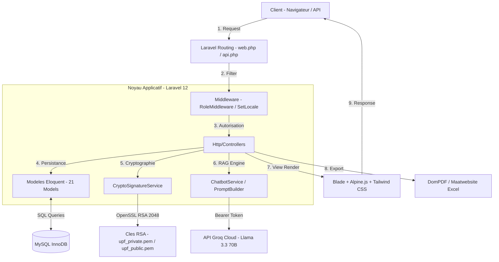
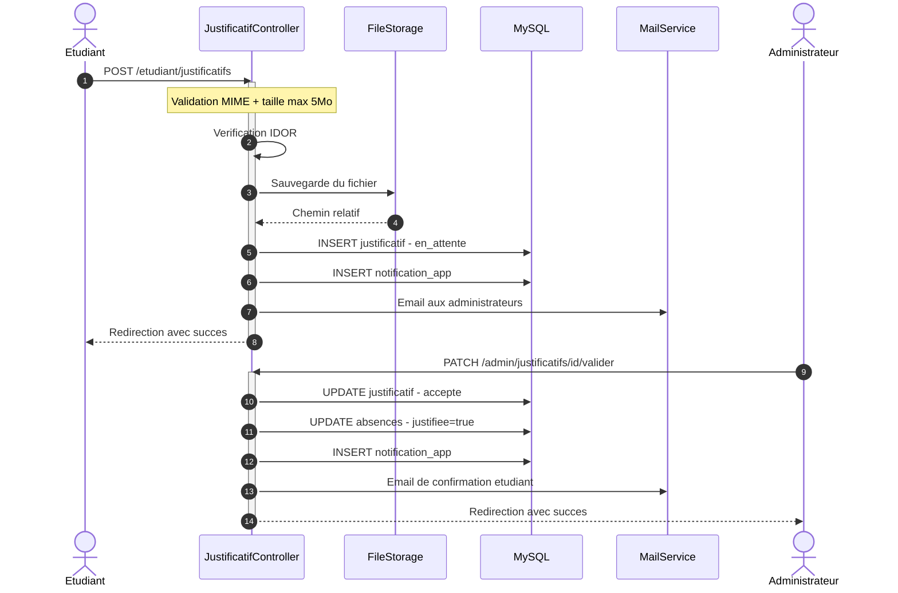

<!--
  E-UPF - README.md
  Premium SaaS-Grade Product & Technical Documentation
-->

<div align="center">

# 🏛️ E-UPF
### *L'écosystème numérique unifié de l'Université Privée de Fès*

<p align="center" style="font-size: 1.15em; max-width: 800px; color: #4A5568; line-height: 1.6;">
  Une plateforme ERP & SIS (Student Information System) de confiance, ultra-sécurisée et intelligente. Conçue pour dématérialiser, automatiser et certifier l'ensemble des flux académiques, administratifs et logistiques universitaires.
</p>

[](https://www.php.net/)
[](https://laravel.com/)
[](https://tailwindcss.com/)
[](https://alpinejs.dev/)
[](https://groq.com/)

---
</div>

## 📌 1. Problématique & Objectif

Les institutions universitaires modernes luttent constamment contre la **dispersion opérationnelle**. Les notes, la présence, la réservation des infrastructures, le suivi administratif et le contact avec les parents sont trop souvent répartis sur des applications cloisonnées. Ce silotage engendre des inefficacités administratives, un manque de visibilité pour les parents et, surtout, des risques critiques de fraude sur les documents officiels.

**E-UPF résout ces défis majeurs en intégrant quatre dimensions fondamentales :**
*   **Centralisation Totale** : Unification des plannings (FullCalendar), des notes scolaires et des fiches d'assiduité dans une base de données MySQL hautement indexée.
*   **Sécurisation Asymétrique (PKI)** : Une infrastructure de clé publique (RSA-2048) intégrée pour signer numériquement les relevés de notes et attestations, les rendant instantanément vérifiables à l'aide d'un QR code unique de confiance.
*   **Autonomie & Co-responsabilité** : Des espaces dédiés et étanches pour les professeurs ( notation, appels, réservations anti-conflits) et les étudiants ( Classroom collaborative, dépôt de justificatifs protégés anti-IDOR).
*   **Portail Parent Augmenté par l'IA (RAG)** : Un espace où les parents peuvent suivre graphiquement la scolarité de leur enfant et dialoguer avec un Assistant IA contextuel brisé par un limiteur de débit et connecté aux données académiques réelles.

---

## ⚡ 2. Key Features

L'écosystème E-UPF est divisé en **4 portails applicatifs hermétiques**, chacun conçu pour offrir une expérience utilisateur fluide et adaptée :

```
┌───────────────────────────────────────────────────────────────────────────────────────────┐
│                                   PLATEFORME UNIQUE E-UPF                                 │
├──────────────────────────┬──────────────────────────┬──────────────────────────┬──────────┤
│ 🧑‍💻 Portail Admin          │ 👨‍🏫 Portail Professeur     │ 🎓 Portail Étudiant       │ 🧑‍👩‍👧‍👦 Parent │
├──────────────────────────┼──────────────────────────┼──────────────────────────┼──────────┤
│ • Gouvernance structure   │ • Appel en classe direct │ • Attestations en ligne  │ • Suivi  │
│ • EDT via FullCalendar   │ • Notation matricielle   │ • Coffre-fort numérique  │   visuel │
│ • Sceau officiel PKI     │ • Réservations de salles │ • Dépôt de justificatifs │ • Chat   │
│ • Monitoring & Comptes   │ • Partage de cours       │ • Classroom synchrone    │   IA RAG │
└──────────────────────────┴──────────────────────────┴──────────────────────────┴──────────┘
```

### 🧑‍💻 Espace Administrateur (Gouvernance & Infrastructure)
*   **Gestion Référentielle** : Administration complète (CRUD) des structures académiques (filières, niveaux, groupes, modules, salles).
*   **Planification Avancée** : Emplois du temps interactifs via FullCalendar avec gestion en direct des conflits de créneaux.
*   **Certification Administrative** : Approbation, émission et scellement asymétrique des documents officiels pour les étudiants.
*   **Gestion des Comptes** : Contrôle centralisé de l'activation des utilisateurs avec double niveau de verrouillage sécurisé.

### 👨‍🏫 Espace Enseignant (Pédagogie & Évaluation)
*   **Notation Matricielle** : Saisie sécurisée et rapide des notes (CC1, CC2, Examen) avec calcul dynamique de la moyenne pondérée.
*   **Feuille d'Appel Numérique** : Enregistrement en direct des présences séance par séance, synchronisé automatiquement avec le dossier étudiant.
*   **Réservation de Salles** : Module de réservation de salles protégée par un algorithme mathématique strict d'anti-collision horaire.
*   **Classroom & Ressources** : Partage de supports de cours et publication d'annonces urgentes à destination des étudiants.

### 🎓 Espace Étudiant (Services en ligne & Autonomie)
*   **Services Administratifs** : Demandes d'attestations et relevés de notes dans plusieurs langues (FR/EN/AR).
*   **Dépôt Justificatifs** : Téléversement sécurisé de pièces justificatives (PDF/Images, max 5 Mo) avec vérifications d'autorisation robustes (anti-faille IDOR).
*   **Consultation & Documents** : Accès au calendrier des cours, notes finales et téléchargement des documents certifiés munis de QR code.

### 🧑‍👩‍👧‍👦 Espace Parent (Supervision & Dialogue IA)
*   **Miroir Académique** : Vue d'ensemble graphique de la scolarité (moyennes, absences, planning) de l'étudiant.
*   **Assistant IA Contextuel (RAG)** : Chatbot intelligent connecté à Groq (Llama-3.3-70b-versatile) analysant la situation scolaire en temps réel pour répondre précisément aux questions des parents en évitant toute hallucination.
*   **Sécurité du Chat** : Rate limiter restrictif à 20 messages par jour pour éviter les abus de quota API.

---

## 🏛️ 3. System Architecture

Le cœur technique d'E-UPF s'appuie sur le framework **Laravel 12.0** configuré selon une architecture MVC rigoureuse, complété par des services spécialisés et une base de données MySQL performante :



---

## 🔄 4. User Flow / System Flow

Ce schéma retrace le flux d'exécution complet et sécurisé lors de la soumission d'un justificatif d'absence par un étudiant, sa validation par l'administration, et la mise à jour correspondante des droits et alertes :



---

## 📂 5. Project Structure

L'arborescence physique du projet est hautement modulaire, garantissant une séparation claire des responsabilités :

```
gestion-universitaire/
 ├── app/
 │    ├── Http/
 │    │    ├── Controllers/        # Contrôleurs métier cloisonnés par portail (Admin, Professeur, Etudiant, Parent, Api)
 │    │    └── Middleware/         # Intercepteurs de requêtes (RoleMiddleware, SetLocale)
 │    ├── Models/                  # 21 Modèles Eloquent modélisant fidèlement le schéma de données
 │    ├── Services/                # Services autonomes complexes
 │    │    ├── CryptoSignatureService.php  # Gestion des signatures de documents officiels RSA-2048
 │    │    └── AI/                 # Modules d'intelligence artificielle
 │    │         ├── ChatbotService.php     # Connexion à l'API Groq (Llama-3.3)
 │    │         └── PromptBuilder.php      # Construction dynamique du contexte étudiant (RAG)
 │    ├── Mail/                    # Fiches et courriels transactionnels
 │    └── Exports/                 # Moteurs d'exportation tabulaire Excel
 ├── config/                       # Fichiers de configuration applicatifs (database, mail, services)
 ├── database/
 │    ├── migrations/              # Fichiers DDL créant la structure de la base de données
 │    └── seeders/                 # Jeux de données de test et comptes démos
 ├── docs/                         # Bibliothèque des diagrammes et schémas officiels du projet
 ├── resources/
 │    ├── views/                   # Vues d'interface en Laravel Blade & Alpine.js
 │    └── css/app.css              # Style général de l'application
 └── routes/
      ├── web.php                  # Routes de navigation de l'interface web (120+ routes)
      └── api.php                  # Endpoints RESTful sécurisés par jetons Sanctum
```

Chaque répertoire remplit un rôle unique :
*   `app/Http/Controllers/` : Coordonne la logique applicative par profil d'accès.
*   `app/Models/` : Représente la couche d'accès aux données avec relations associées.
*   `app/Services/` : Encapsule les fonctionnalités avancées (IA, cryptographie).
*   `database/` : Gère le versioning du schéma relationnel.
*   `resources/views/` : Contient les gabarits d'affichage et l'interface utilisateur.
*   `routes/` : Définit les points d'entrée web et d'API.

---

## 🖼️ 6. Documentation Visuelle (docs/)

L'ensemble des diagrammes d'analyse officiels sont stockés dans le dossier [docs/](file:///d:/3eme%20annee/S6/TW/exam/gestion-universitaire/docs) et servent de référence technique :

*   📊 **Architecture Applicative** : [Diagramme de Flux Conceptuel](docs/1.%20📊%20Diagramme%20Conceptuel%20%26%20Architecture%20Applicative%20(Flowchart).png)
*   🧑‍💻 **Cas d'Utilisation** : [Diagramme des Cas d'Utilisation (Use Case)](docs/usecase.png)
*   🏛️ **Modèle de Classes** : [Diagramme de Classes UML](docs/class.png)
*   🔄 **Workflow d'Assiduité** : [Diagramme de Séquence - Justificatifs](docs/Diagramme%20de%20SéquenceApprobation%20de%20Justificatif%20d'Absence.png)
*   🤖 **Intégration RAG** : [Diagramme de Séquence - Assistant IA](docs/Diagramme%20de%20Séquence%20%20Consultation%20RAG%20via%20l'Assistant%20IA%20Parent.png)
*   🔑 **Scellement Cryptographique** : [Diagramme de Séquence - Sceau PKI](docs/seq.png)
*   🗄️ **Base de Données** : [Modèle Conceptuel de Données (MCD)](docs/mcd.png)

---

## 🧠 7. Core Logic / Business Logic

### 📊 Calculateur de Note Finale (Note.php)
Le calcul de la moyenne de module est normé selon des pondérations fixes appliquées dans le modèle :
$$\text{Moyenne} = \left(\frac{\text{CC1} + \text{CC2}}{2}\right) \times 0.4 + \text{Examen} \times 0.6$$
*Règle d'ajournement* : Si $\text{Moyenne} < 10.00$, le statut du module bascule sur `'ajourné'`, ouvrant le droit d'accès aux sessions de rattrapage.

### 🚫 Algorithme Anti-Collision (ReservationController.php)
Le système prévient mathématiquement toute collision horaire de réservations pour une même salle lors de l'insertion :
```php
$conflit = ReservationSalle::where('salle_id', $request->salle_id)
    ->whereDate('date', $request->date)
    ->where('statut', 'confirmee')
    ->where(function ($query) use ($request) {
        $query->where(function ($q) use ($request) {
            $q->where('heure_debut', '>=', $request->heure_debut)
              ->where('heure_debut', '<', $request->heure_fin);
        })
        ->orWhere(function ($q) use ($request) {
            $q->where('heure_fin', '>', $request->heure_debut)
              ->where('heure_fin', '<=', $request->heure_fin);
        })
        ->orWhere(function ($q) use ($request) {
            $q->where('heure_debut', '<=', $request->heure_debut)
              ->where('heure_fin', '>=', $request->heure_fin);
        });
    })->exists();
```

### 🔑 Signature PKI RSA-2048 & QR Code
Le service [CryptoSignatureService.php](file:///d:/3eme%20annee/S6/TW/exam/gestion-universitaire/app/Services/CryptoSignatureService.php) garantit l'inviolabilité des documents officiels :
1.  **Canonicité** : Le payload de données est encodé de manière déterministe (`json_encode` avec tris).
2.  **Hachage** : Génération d'un hash SHA-256 du payload.
3.  **Signature asymétrique** : Signature du hash avec la clé privée de l'université (RSA 2048-bit).
4.  **QR Code de confiance** : Génération d'un QR code contenant le lien public de vérification `/verify/{documentId}`.

---

## 🌐 8. API / Interaction Layer

Le système expose des endpoints REST documentés pour d'éventuelles applications mobiles ou intégrations :

### Endpoints Majeurs

*   `POST /api/login` : Authentification, retourne le token Bearer Sanctum.
*   `GET /api/me` (Auth requis) : Retourne le profil utilisateur connecté.
*   `GET /api/notes` (Auth requis) : 
    *   *Pour l'étudiant* : Ses notes détaillées par module et sa moyenne générale courante.
    *   *Pour le professeur* : La liste des modules sous sa responsabilité et leurs moyennes globales de groupe.
*   `GET /api/verify/{documentId}` (Public) : Endpoint de décodage cryptographique. Il récupère la signature associée, la décode à l'aide de la clé publique de l'université et confirme si le document a été falsifié ou non.

#### Exemple de Réponse : Connexion Réussie (`POST /api/login`)
```json
{
  "message": "Connexion réussie.",
  "token": "3|a8F9...tY6z",
  "token_type": "Bearer",
  "user": {
    "id": 14,
    "nom": "NAHLI",
    "prenom": "Amine",
    "email": "student@upf.ma",
    "role": "etudiant"
  }
}
```

#### Exemple de Réponse : Document Certifié Valide (`GET /api/verify/{documentId}`)
```json
{
  "status": "valid",
  "data": {
    "student_name": "Amine NAHLI",
    "document_type": "releve_notes",
    "gpa": "16.85",
    "academic_year": "2025/2026",
    "details": {
      "Génie Logiciel": "17.00",
      "Technologies Web": "16.50"
    }
  }
}
```

---

## 🔐 9. Security Thinking

*   **Authentification Robuste** : Sessions web étanches protégées par CSRF, doublées d'une API Stateless sécurisée par jetons d'accès Sanctum (`personal_access_tokens`).
*   **Contrôle d'Accès par Rôles** : Middleware d'alias `'role'` (`RoleMiddleware.php`) interdisant tout contournement de route. Il gère également le verrouillage immédiat des comptes inactifs (`is_active = false`).
*   **Protection Anti-IDOR** : Chaque action étudiant/professeur est validée au niveau de la base de données pour vérifier la propriété de la ressource demandée (ex: impossible d'altérer la note d'un groupe non affecté, ou de téléverser un justificatif sur l'absence d'un autre étudiant).
*   **Défense du Stockage** : Téléversements de fichiers limités par type MIME et contraints en taille pour prévenir les attaques par déni de service logique (DoS).

---

## 🛠️ 10. Installation & Run

### Prérequis
*   PHP 8.2+ (avec extensions `openssl`, `pdo_mysql`, `gd`, `zip`, `mbstring`)
*   Composer 2.x
*   Node.js 18+ & npm
*   Base de données MySQL 8.0+

### Procédure de déploiement
1.  **Cloner le dépôt :**
    ```bash
    git clone https://github.com/Amine-NAHLI/gestion-universitaire.git
    cd gestion-universitaire
    ```
2.  **Installer les dépendances :**
    ```bash
    composer install
    npm install
    ```
3.  **Configurer l'environnement :**
    ```bash
    cp .env.example .env
    php artisan key:generate
    ```
    *Renseignez vos accès MySQL et votre clé d'API Groq (`GROQ_API_KEY`) dans le fichier `.env`.*

4.  **Initialiser la base de données (Tables & Seeders) :**
    ```bash
    php artisan migrate --seed
    ```
5.  **Lancer l'application :**
    ```bash
    npm run dev
    # Ouvrir un second terminal
    php artisan serve
    ```

---

## 🧪 11. Testing Strategy

Le projet incorpore une suite complète de tests unitaires et fonctionnels (PHPUnit) garantissant la stabilité du système face aux régressions :

```bash
# Lancement de l'intégralité des tests automatisés
php artisan test
```

### Stratégie de tests implémentée
*   **Tests d'Authentification Avancés (`tests/Feature/Auth`)** : Couvrent l'inscription, la modification de mot de passe, l'authentification parentale et l'appairage automatique d'adresse email parent `student@upf.ma+parent`.
*   **Tests d'Autorisation de Middleware (`RoleMiddlewareTest.php`)** : Valident que les utilisateurs inactifs sont immédiatement rejetés et déconnectés, et que l'accès aux espaces est strictement régi par le rôle.
*   **Tests d'Intégrité Logistique (`RoomReservationConflictTest.php`)** : Simulent la soumission de deux réservations chevauchantes pour s'assurer que le système bloque mathématiquement le second conflit et conserve l'intégrité de la base de données.

---

## 🚀 12. Roadmap & Évolutions Futures

*   **Optimisation Temporelle par IA** : Implémentation d'un algorithme génétique de planification pour générer les EDT de l'université sans conflits de professeurs ni de salles.
*   **OCR Intelligent** : Analyse automatisée par vision des justificatifs d'absence soumis par les étudiants afin de pré-valider les motifs (maladie, convocation officielle) et alléger le travail de l'administration.
*   **Analyses de Rétention Scolaire** : Tableau de bord de statistiques prédictives pour détecter les risques d'ajournement ou d'abandon selon l'assiduité et les notes de contrôle continu.
*   **Passerelle SMS d'Alerte** : Notification push SMS instantanée aux parents lors d'une absence non justifiée ou d'une note de rattrapage.

---

## ❓ 13. FAQ (Foire Aux Questions)

#### Comment fonctionne l'Assistant IA Parent ?
Il s'appuie sur le modèle de langage **Llama 3.3** via l'API Groq. Le système injecte les notes réelles, les absences courantes et les demandes de l'élève dans le contexte d'appel (RAG). L'IA est bridée par des consignes strictes qui lui interdisent de spéculer ou d'aborder des sujets externes à la scolarité.

#### Est-ce que le système de documents signés est vraiment sécurisé ?
Oui. La signature est asymétrique. Elle est générée avec la clé privée de l'UPF (RSA 2048-bit) et ne peut être forgée. La clé publique (accessible en lecture seule) est uniquement utilisée pour valider que le hash SHA-256 du relevé de notes n'a pas été modifié. Toute altération manuelle du PDF (modification de note, changement de nom) invalide instantanément la signature.

#### Comment est structuré le code des espaces utilisateurs ?
Le code est cloisonné dans des sous-répertoires dédiés au sein de `app/Http/Controllers/` et `resources/views/`. Les contrôleurs héritent du noyau Laravel mais sont isolés dans des namespaces propres (`Admin\`, `Professeur\`, `Etudiant\`, `Parent\`), empêchant tout couplage fort et simplifiant les futurs refactorings.

#### Comment ajouter un nouveau rôle d'utilisateur (ex: Scolarité) ?
1.  Ajoutez le rôle dans l'enum SQL de la migration `users` (colonne `role`).
2.  Créez un sous-dossier de contrôleurs et de vues dédiés.
3.  Déclarez un groupe de routes dans `routes/web.php` protégé par le middleware `role:scolarite`.
4.  Implémentez les redirections correspondantes dans la route racine `/dashboard`.

---

<div align="center">

### 🏛️ E-UPF : Redéfinir l'Expérience Universitaire par l'Ingénierie Logicielle

*Développé par **Amine NAHLI** sous la supervision du **Pr. Marwane KZADRI**.*  
*Université Privée de Fès — Filière Génie Informatique / Technologies Web.*

</div>
