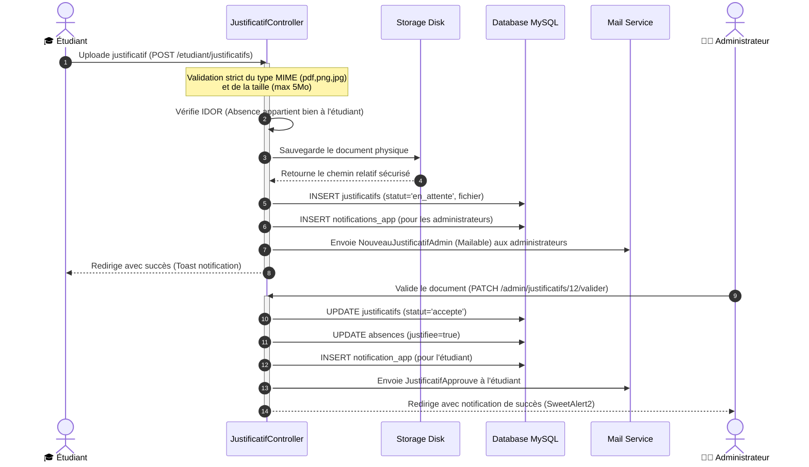

<div align="center">

# 🏛️ E-UPF : Système Intégré de Gestion Universitaire
### *L'infrastructure d'exploitation académique et administrative de l'Université Privée de Fès*

<br/>

[](https://www.php.net/)
[](https://laravel.com/)
[](https://tailwindcss.com/)
[](https://alpinejs.dev/)
[](https://groq.com/)

<p align="center" style="font-size: 1.15em; max-width: 720px; color: #4B5563; line-height: 1.6;">
  Une plateforme ERP/SIS unifiée et hautement sécurisée, conçue pour dématérialiser et centraliser les flux pédagogiques, administratifs et logistiques. Elle propose une architecture multi-rôle, un moteur cryptographique PKI pour la certification des diplômes et relevés de notes, ainsi qu'un Assistant IA Parent contextuel (RAG).
</p>

---
</div>

## 📌 1. Problématique & Objectif

Les universités font face au défi de la **dispersion des données**. Les plannings, les notes, le suivi d'absences, la logistique des salles et les requêtes administratives sont trop souvent cloisonnés dans des outils hétérogènes, induisant des inefficacités opérationnelles, un manque de suivi parental et des risques élevés d'altération de documents officiels.

**E-UPF unifie l'écosystème universitaire sur une plateforme unique et infalsifiable :**
*   **Centralisation Métier** : Pilotage global des filières, des emplois du temps (EDT) et des attributions d'enseignements.
*   **Sécurisation par la Cryptographie** : Implémentation d'une infrastructure de clé publique (PKI) signant numériquement les relevés de notes et attestations officielles, vérifiables instantanément par un QR Code de confiance.
*   **Responsabilisation & Collaboration** : Espaces autonomes pour enseignants (saisie matricielle de notes, appel en direct, réservation de salles) et étudiants (dépôt de justificatifs d'absence protégés contre les failles IDOR, Classroom collaborative).
*   **Lien Parental Augmenté** : Portail parent doté d'un assistant IA contextuel sécurisé par rate limiter, capable de restituer en direct la situation de l'étudiant à partir de données réelles sans aucune hallucination.

---

## ⚡ 2. Key Features

L'application découpe les privilèges en 4 portails étanches pilotés par un système d'autorisation granulaire :

```
┌─────────────────────────────────────────────────────────────────────────────────────────┐
│                                    PORTAIL APPLICATIF                                   │
├─────────────────────────┬─────────────────────────┬─────────────────────────┬───────────┤
│ 🧑‍💻 Administrateur        │ 👨‍🏫 Enseignant           │ 🎓 Étudiant             │ 🧑‍👩‍👧‍👦 Parent  │
├─────────────────────────┼─────────────────────────┼─────────────────────────┼───────────┤
│ • Gestion BDD           │ • Appel numérique       │ • Coffre-fort PDF       │ • Suivi   │
│   (Filières/Comptes)    │   (Absences directes)   │   (Attestations)        │   visuel  │
│ • EDT interactif        │ • Notation matricielle  │ • Dépôt justificatifs   │ • Chatbot │
│   (FullCalendar)        │   (CC1/CC2/Examen)      │   (Anti-IDOR, max 5Mo)  │   IA RAG  │
│ • Validation PKI        │ • Réservation de salles │ • Espace Classroom      │ • Alertes │
│   (Signatures / Sceaux) │   (Anti-collision)      │   (Supports de cours)   │   pushs   │
└─────────────────────────┴─────────────────────────┴─────────────────────────┴───────────┘
```

### 🧑‍💻 Espace Administrateur (Gouvernance & Flux)
*   **Gestion Référentielle** : CRUD complet des structures académiques (filières GC, GINFO, GIND, niveaux, groupes, modules, salles).
*   **Planification Interactive** : Calendrier dynamique (FullCalendar) gérant le glisser-déposer des séances et prévenant les chevauchements.
*   **Sceau Universitaire** : Approbation des demandes administratives et validation de pièces d'assiduité avec certification cryptographique.

### 👨‍🏫 Espace Enseignant (Pédagogie & Évaluation)
*   **Saisie Matricielle** : Saisie ergonomique des notes de contrôles continus et examens avec calcul automatique des moyennes pondérées.
*   **Feuille d'Appel Virtuelle** : Appel d'assiduité en temps réel créant des fiches d'absences structurées en base de données.
*   **Anti-Overlapping Logistique** : Réservation de salles de cours protégée par un algorithme d'exclusion temporelle mutuelle.
*   **Espace Classroom** : Diffusion de messages urgents et de documents de cours volumineux (jusqu'à 20 Mo).

### 🎓 Espace Étudiant (Services en ligne & Autonomie)
*   **Services Administratifs** : Commande en ligne d'attestations et de relevés officiels en Français, Anglais ou Arabe.
*   **Justification en Ligne** : Dépôt sécurisé de pièces justificatives (PDF/images de max 5 Mo) avec vérification d'autorisation (Anti-IDOR).
*   **Consultation Globale** : Accès transparent à l'emploi du temps, carnet de notes et supports pédagogiques.

### 🧑‍👩‍👧‍👦 Espace Parent (Supervision & Dialogue IA)
*   **Miroir Scolaire** : Accès graphique aux résultats (Chart.js), aux fiches de présence et aux plannings de son enfant.
*   **Assistant IA Contextuel** : Chatbot intelligent connecté à l'API Groq (Llama-3.3-70b-versatile) capable d'analyser le dossier de l'élève en direct (RAG) et de formuler des réponses multilingues claires et bienveillantes.

---

## 🏛️ 3. System Architecture

Le portail repose sur une architecture **MVC (Model-View-Controller)** moderne, avec injection de dépendances applicatives et séparation stricte des responsabilités métier.

```mermaid
graph TD
    Client["🔑 Client (Navigateur / API Request)"] -->|1. Requête| Route["📂 Laravel Routing (web.php / api.php)"]
    Route -->|2. Filtrage| Middleware["🛡️ Middleware (RoleMiddleware / SetLocale)"]
    
    subgraph Noyau applicatif (Laravel 12)
        Middleware -->|3. Autorisation| Controller["🎮 Http/Controllers (Espaces Métier)"]
        Controller -->|4. Persistance| Eloquent["💾 Modèles Eloquent (App/Models)"]
        Controller -->|5. Sceau PKI| Crypto["🔑 Services/CryptoSignatureService.php"]
        Controller -->|6. Service RAG| AI["🤖 Services/AI/ChatbotService.php"]
    end
    
    Eloquent <-->|SQL| DB[("🗄️ Database MySQL (InnoDB)")]
    Crypto -->|RSA 2048-bit| RSA["🔑 OpenSSL (Private/Public Keys)"]
    AI -->|Bearer Session| Groq["☁️ API Cloud Groq (Llama-3.3)"]
    
    Controller -->|7. Rendu| View["🎨 Templating Blade (Alpine.js / Tailwind CSS)"]
    Controller -->|8. Téléchargement| PDF["📄 Moteur DomPDF / Maatwebsite Excel"]
    
    View -->|9. Affichage| Client
```

---

## 🔄 4. User Flow / System Flow

Ce diagramme de séquence montre le flux d'exécution complet lors du dépôt et de la validation d'un justificatif d'absence d'étudiant, de la soumission à l'archivage en base de données et l'envoi d'emails.



---

## 📂 5. Project Structure

L'arborescence du projet est rationalisée pour cloisonner efficacement les différentes responsabilités :

```
gestion-universitaire/
 ├── app/
 │    ├── Http/
 │    │    ├── Controllers/         # Contrôleurs métier (Admin, Professeur, Etudiant, Parent, Api)
 │    │    └── Middleware/          # Intercepteurs de requêtes (RoleMiddleware, SetLocale)
 │    ├── Models/                   # 21 Modèles Eloquent matérialisant le schéma BDD
 │    ├── Services/                 # Services applicatifs complexes (CryptoSignature, Chatbot AI)
 │    ├── Mail/                     # Notifications transactionnelles par e-mail
 │    └── Exports/                  # Exportations tabulaires Excel
 ├── bootstrap/
 │    └── app.php                   # Fichier d'initialisation, enregistrement des middlewares & alias
 ├── config/                        # Fichiers de configuration (Database, Services, Mail, Sanctum)
 ├── database/
 │    ├── migrations/               # Fichiers DDL de création des 30 tables normalisées
 │    └── seeders/                  # Données initiales et comptes démos
 ├── docs/                          # Répertoire des diagrammes UML et schémas d'architecture
 ├── resources/
 │    ├── views/                    # Interfaces utilisateur rédigées en Blade & Alpine.js
 │    └── css/app.css               # Point d'entrée des styles Tailwind CSS
 └── routes/
      ├── web.php                   # 120+ Routes d'interface Web sécurisées
      └── api.php                   # 25+ Routes API REST sécurisées par Sanctum
```

---

## 🖼️ 6. Documentation Visuelle (docs/)

L'ensemble des diagrammes d'analyse et de conception officielle du projet sont archivés au sein du répertoire [docs/](file:///d:/3eme%20annee/S6/TW/exam/gestion-universitaire/docs) :

*   📊 **Architecture Globale** : [Diagramme Conceptuel](docs/1. 📊 Diagramme Conceptuel & Architecture Applicative (Flowchart).png)
*   🧑‍💻 **Cas d'Utilisation** : [Use Case Diagram](docs/usecase.png)
*   🏛️ **Modèle de Classes** : [Class Diagram](docs/class.png)
*   🔄 **Workflow Pédagogique** : [Sequence Diagram (Absence Approval)](docs/Diagramme de SéquenceApprobation de Justificatif d'Absence.png)
*   🤖 **Intégration d'IA** : [Sequence Diagram (AI Parent Chatbot RAG)](docs/Diagramme de Séquence  Consultation RAG via l'Assistant IA Parent.png)
*   🔑 **Scellement Cryptographique** : [Sequence Diagram (Signature Verification)](docs/seq.png)
*   🗄️ **Base de Données** : [MCD Diagram](docs/mcd.png)

---

## 🧠 7. Core Logic / Business Logic

### 📊 Algorithme d'Évaluation Scolaire (Note.php)
Le calcul de la moyenne de module est normé selon des pondérations fixes appliquées dans le modèle :
$$Moyenne = (CC1 + CC2)/2 \times 0.4 + Examen \times 0.6$$
*Règle d'ajournement* : Si $Moyenne < 10.00$, le statut du module bascule sur `'ajourné'`, ouvrant le droit d'accès aux sessions de rattrapage.

### 🚫 Algorithme Anti-Collision (ReservationController.php)
Le système protège les réservations de salles de cours contre tout chevauchement en effectuant une vérification d'exclusion temporelle mutuelle à l'insertion :
```sql
SELECT EXISTS (
    SELECT * FROM reservations_salles 
    WHERE salle_id = :salle_id 
      AND date = :date 
      AND statut = 'confirmee'
      AND (
          (heure_debut >= :debut AND heure_debut < :fin) OR -- Nouveau début dans un créneau existant
          (heure_fin > :debut AND heure_fin <= :fin) OR     -- Nouvelle fin dans un créneau existant
          (heure_debut <= :debut AND heure_fin >= :fin)     -- Nouveau créneau englobant un existant
      )
);
```

### 🔒 Signature PKI RSA-2048 & QR Code
Le service [CryptoSignatureService.php](file:///d:/3eme%20annee/S6/TW/exam/gestion-universitaire/app/Services/CryptoSignatureService.php) sécurise les relevés et attestations :
1.  **Canonicité** : Le payload de données est encodé de manière déterministe (`json_encode` avec tris).
2.  **Hachage** : Génération d'un hash SHA-256 du payload.
3.  **Signature asymétrique** : Signature du hash avec la clé privée de l'université (RSA 2048-bit).
4.  **QR Code de confiance** : Génération d'un QR code contenant le lien public de vérification `/verify/{documentId}`.

---

## 🌐 8. API / Interaction Layer

Le système expose des endpoints REST documentés pour d'éventuelles applications mobiles ou intégrations :

### Endpoints Majeurs

*   `POST /api/login` : Authentification, retourne le token Bearer Sanctum.
*   `GET /api/me` (Auth requis) : Retourne le profil utilisateur connecté.
*   `GET /api/notes` (Auth requis) : 
    *   *Pour l'étudiant* : Ses notes détaillées par module et sa moyenne générale courante.
    *   *Pour le professeur* : La liste des modules sous sa responsabilité et leurs moyennes globales de groupe.
*   `GET /api/verify/{documentId}` (Public) : Endpoint de décodage cryptographique. Il récupère la signature associée, la décode à l'aide de la clé publique de l'université et confirme si le document a été falsifié ou non.

#### Exemple de Réponse : Connexion Réussie (`POST /api/login`)
```json
{
  "message": "Connexion réussie.",
  "token": "3|a8F9...tY6z",
  "token_type": "Bearer",
  "user": {
    "id": 14,
    "nom": "NAHLI",
    "prenom": "Amine",
    "email": "student@upf.ma",
    "role": "etudiant"
  }
}
```

---

## 🔐 9. Security Thinking

*   **Authentification Robuste** : Sessions web étanches protégées par CSRF, doublées d'une API Stateless sécurisée par jetons d'accès Sanctum (`personal_access_tokens`).
*   **Contrôle d'Accès par Rôles** : Middleware d'alias `'role'` (`RoleMiddleware.php`) interdisant tout contournement de route. Il gère également le verrouillage immédiat des comptes inactifs (`is_active = false`).
*   **Protection Anti-IDOR** : Chaque action étudiant/professeur est validée au niveau de la base de données pour vérifier la propriété de la ressource demandée (ex: impossible d'altérer la note d'un groupe non affecté, ou de téléverser un justificatif sur l'absence d'un autre étudiant).
*   **Défense du Stockage** : Téléversements de fichiers limités par type MIME et contraints en taille pour prévenir les attaques par déni de service logique (DoS).

---

## 🛠️ 10. Installation & Run

### Prérequis
*   PHP 8.2+ (avec extensions `openssl`, `pdo_mysql`, `gd`, `zip`, `mbstring`)
*   Composer 2.x
*   Node.js 18+ & npm
*   Base de données MySQL 8.0+

### Procédure de déploiement
1.  **Cloner le dépôt :**
    ```bash
    git clone https://github.com/Amine-NAHLI/gestion-universitaire.git
    cd gestion-universitaire
    ```
2.  **Installer les dépendances :**
    ```bash
    composer install
    npm install
    ```
3.  **Configurer l'environnement :**
    ```bash
    cp .env.example .env
    php artisan key:generate
    ```
    *Renseignez vos accès MySQL et votre clé d'API Groq (`GROQ_API_KEY`) dans le fichier `.env`.*

4.  **Initialiser la base de données (Tables & Seeders) :**
    ```bash
    php artisan migrate --seed
    ```
5.  **Lancer l'application :**
    ```bash
    npm run dev
    # Ouvrir un second terminal
    php artisan serve
    ```

---

## 🧪 11. Testing Strategy

Le projet incorpore une suite complète de tests unitaires et fonctionnels (PHPUnit) garantissant la stabilité du système face aux régressions :

```bash
# Lancement de l'intégralité des tests automatisés
php artisan test
```

### Stratégie de tests implémentée
*   **Tests d'Authentification Avancés (`tests/Feature/Auth`)** : Couvrent l'inscription, la modification de mot de passe, l'authentification parentale et l'appairage automatique d'adresse email parent `student@upf.ma+parent`.
*   **Tests d'Autorisation de Middleware (`RoleMiddlewareTest.php`)** : Valident que les utilisateurs inactifs sont immédiatement rejetés et déconnectés, et que l'accès aux espaces est strictement régi par le rôle.
*   **Tests d'Intégrité Logistique (`RoomReservationConflictTest.php`)** : Simulent la soumission de deux réservations chevauchantes pour s'assurer que le système bloque mathématiquement le second conflit et conserve l'intégrité de la base de données.

---

## 🚀 12. Roadmap & Évolutions Futures

*   **Optimisation Temporelle par IA** : Implémentation d'un algorithme génétique de planification pour générer les EDT de l'université sans conflits de professeurs ni de salles.
*   **OCR Intelligent** : Analyse automatisée par vision des justificatifs d'absence soumis par les étudiants afin de pré-valider les motifs (maladie, convocation officielle) et alléger le travail de l'administration.
*   **Analyses de Rétention Scolaire** : Tableau de bord de statistiques prédictives pour détecter les risques d'ajournement ou d'abandon selon l'assiduité et les notes de contrôle continu.
*   **Passerelle SMS d'Alerte** : Notification push SMS instantanée aux parents lors d'une absence non justifiée ou d'une note de rattrapage.

---

## ❓ 13. FAQ (Foire Aux Questions)

#### Comment fonctionne l'Assistant IA Parent ?
Il s'appuie sur le modèle de langage **Llama 3.3** via l'API Groq. Le système injecte les notes réelles, les absences courantes et les demandes de l'élève dans le contexte d'appel (RAG). L'IA est bridée par des consignes strictes qui lui interdisent de spéculer ou d'aborder des sujets externes à la scolarité.

#### Est-ce que le système de documents signés est vraiment sécurisé ?
Oui. La signature est asymétrique. Elle est générée avec la clé privée de l'UPF (RSA 2048-bit) et ne peut être forgée. La clé publique (accessible en lecture seule) est uniquement utilisée pour valider que le hash SHA-256 du relevé de notes n'a pas été modifié. Toute altération manuelle du PDF (modification de note, changement de nom) invalide instantanément la signature.

#### Comment est structuré le code des espaces utilisateurs ?
Le code est cloisonné dans des sous-répertoires dédiés au sein de `app/Http/Controllers/` et `resources/views/`. Les contrôleurs héritent du noyau Laravel mais sont isolés dans des namespaces propres (`Admin\`, `Professeur\`, `Etudiant\`, `Parent\`), empêchant tout couplage fort et simplifiant les futurs refactorings.

#### Comment ajouter un nouveau rôle d'utilisateur (ex: Scolarité) ?
1.  Ajoutez le rôle dans l'enum SQL de la migration `users` (colonne `role`).
2.  Créez un sous-dossier de contrôleurs et de vues dédiés.
3.  Déclarez un groupe de routes dans `routes/web.php` protégé par le middleware `role:scolarite`.
4.  Implémentez les redirections correspondantes dans la route racine `/dashboard`.

---

<div align="center">

### 🏛️ E-UPF : Redéfinir l'Expérience Universitaire par l'Ingénierie Logicielle

*Développé par **Amine NAHLI** sous la supervision du **Pr. Marwane KZADRI**.*  
*Université Privée de Fès — Filière Génie Informatique / Technologies Web.*

</div>
