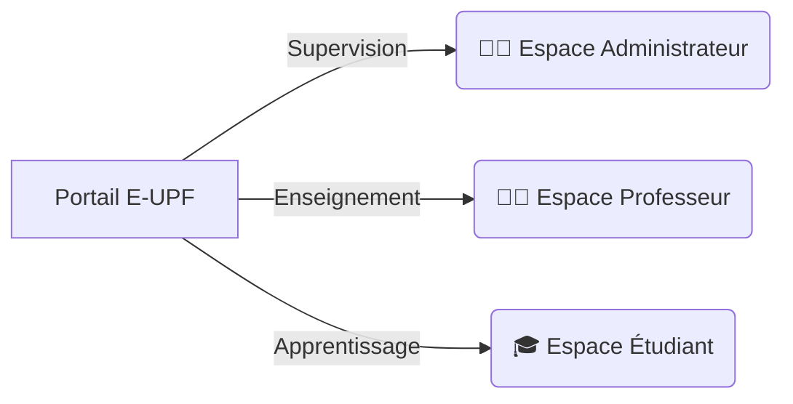

<div align="center">
  
# 🏛️ Gestion Universitaire UPF — Portail E-UPF
**Système d'Information et de Gestion Universitaire Intégré (ERP / SIS) pour l'Université Privée de Fès**

[](https://php.net/)
[](https://laravel.com)
[](https://mysql.com)
[](https://tailwindcss.com)
[](https://alpinejs.dev)
[](LICENSE)
[](https://github.com/Amine-NAHLI/gestion-universitaire)

<p align="center">
  Une plateforme universitaire de nouvelle génération alliant la robustesse d'un backend Laravel 12 à une interface utilisateur premium, réactive et animée.
</p>

---

</div>

## 📖 À Propos du Projet

**Gestion Universitaire UPF (Portail E-UPF)** est une solution applicative complète développée pour centraliser et digitaliser l'intégralité du cycle de vie académique, pédagogique et administratif de l'Université Privée de Fès (UPF).

### 🎓 Cadre Académique
- **Réalisateur :** [Amine NAHLI](https://github.com/Amine-NAHLI) (Filière Génie Informatique / Technologies Web)
- **Encadrant Pédagogique :** Pr. Marwane KZADRI
- **Établissement :** Université Privée de Fès (UPF)
- **Période :** Mai 2026

---

## ✨ Fonctionnalités Clés par Espace

L'application est structurée autour d'un contrôle d'accès strict par rôle (`RoleMiddleware`) divisant l'expérience en trois portails sur-mesure :



### 🧑‍💻 1. Espace Administrateur (Pilotage & Gestion)
- **Tableau de bord analytique :** Statistiques en temps réel de l'établissement (inscrits, taux d'absentéisme, répartition des notes avec **Chart.js**).
- **Référentiel Universitaire :** Gestion hiérarchique complète en CRUD (Filières $\rightarrow$ Niveaux $\rightarrow$ Groupes $\rightarrow$ Modules avec coefficients et volumes horaires).
- **Gestion des Salles & Équipements :** Suivi de la disponibilité des amphis et salles de TP/TD.
- **Emploi du temps dynamique :** Planification des séances par glisser-déposer (Drag&Drop) via **FullCalendar 6.1** et notification automatique en temps réel des acteurs concernés.
- **Guichet de Validation des Demandes :** Approbation des requêtes administratives et génération instantanée des documents officiels en PDF signés et filigranés.
- **Exports Excel :** Génération instantanée de grilles de notes et de rapports d'absences officiels via **Maatwebsite Excel**.

### 👨‍🏫 2. Espace Professeur (Pédagogie & Évaluation)
- **Saisie Matricielle des Notes :** Interface tabulaire rapide pour entrer les notes de contrôle continu (CC1, CC2) et d'examen. Calcul automatique de la moyenne unitaire pondérée.
- **Feuille de Présence Numérique :** Appel en ligne interactif avec trombinoscope des étudiants pour chaque séance.
- **Cahier de Textes Pédagogique :** Renseignement officiel des objectifs, du contenu et de la nature de la séance (Cours, TD, TP).
- **Espace Classroom :** Espace collaboratif par matière pour publier des annonces (avec options d'épinglage et commentaires) et partager des supports de cours jusqu'à **20 Mo**.
- **Réservation de Salles Anti-Conflit :** Demande de locaux avec algorithme strict détectant les chevauchements et collisions d'horaires.

### 🎓 3. Espace Étudiant (Suivi & Autonomie)
- **Carnet de Notes en Direct :** Consultation du relevé de notes annuel avec calcul instantané de la moyenne générale et statut de validation des crédits.
- **Suivi et Justification des Absences :** Visualisation du compteur d'assiduité et téléversement sécurisé de justificatifs (certificat médical PDF/Image) avec suivi du statut d'approbation.
- **Classroom Apprenant :** Téléchargement des cours, lecture des annonces et espace d'interaction pédagogique.
- **Guichet Administratif Numérique :** Commande en ligne d'attestations de scolarité, relevés de notes et certificats d'inscription en **Français, Anglais ou Arabe** (avec rendu RTL automatique). Téléchargement direct du PDF officiel dès validation.

---

## 🚀 Les 13 Modules Avancés & Spécificités

1. 🗓️ **FullCalendar 6.1 Interactif :** Emploi du temps dynamique avec codes couleurs par type d'enseignement et déplacement d'événements en AJAX.
2. 📊 **Moteur d'Export Excel :** Exportation professionnelle des notes et bilans d'assiduité au format `.xlsx`.
3. 📄 **Générateur PDF Multilingue (DomPDF) :** Création de documents officiels avec polices UTF-8 et gestion native de l'écriture en arabe RTL (Right-to-Left).
4. 🔔 **Système de Notifications In-App :** Alertes en temps réel enregistrées en base de données avec icônes contextuelles et liens de navigation.
5. 📚 **Espace Collaboratif Classroom :** Stockage public sécurisé pour le partage de ressources pédagogiques lourdes.
6. 📝 **Cahier de Textes Pédagogique :** Outil de traçabilité et de suivi de la progression des cours.
7. 🩺 **Workflow de Justification d'Absence :** Processus complet de téléversement, d'examen et de régularisation administrative.
8. 🏛️ **Algorithme Anti-Conflits de Salles :** Prévention infaillible des doubles affectations de locaux sur un même créneau horaire.
9. 📈 **Dashboard & Visualisation Chart.js :** Représentation graphique des performances des étudiants et de la démographie.
10. 🔍 **Recherche Globale Instantanée :** Moteur de recherche AJAX transversal (étudiants, modules, salles, demandes).
11. ✉️ **Moteur de Templates d'E-mails :** 6 classes `Mailable` avec gabarits Blade esthétiques pour les notifications officielles.
12. ✨ **UI Premium & Micro-Animations :** Expérience utilisateur fluide propulsée par **GSAP**, **Notyf** (toasts non bloquants) et **SweetAlert2**.
13. ⚡ **Indexation Stratégique BDD :** Migration de performance avec index composites sur 30 tables garantissant des requêtes complexes en moins de 50 millisecondes.

---

## 🛠️ Stack Technologique Complète

```
┌──────────────────────────────────────────────────────────────────────────┐
│                         ARCHITECTURAL TECH STACK                         │
├──────────────────────┬───────────────────────────────────────────────────┤
│ Couche / Domaine     │ Technologies & Bibliothèques Clés                 │
├──────────────────────┼───────────────────────────────────────────────────┤
│ Langage Core         │ PHP 8.2.12 (Strict typing & attributes)           │
│ Framework Backend    │ Laravel 12.0.0 (Édition moderne)                  │
│ Base de Données      │ MySQL 8.0+ / MariaDB (Moteur InnoDB)              │
│ Sécurité & Auth      │ Laravel Sanctum 4.0 (API Bearer Tokens & Session) │
│ Moteur de Rendu      │ Laravel Blade Templating Engine                   │
│ Framework CSS        │ Tailwind CSS 3.1.0 (Utility-first styling)        │
│ Réactivité Frontend  │ Alpine.js 3.15.0 (Composants dynamiques légers)   │
│ Bundler & Build Tool │ Vite 5.0 (HMR - Hot Module Replacement)           │
└──────────────────────┴───────────────────────────────────────────────────┘
```

---

## 📦 Instructions d'Installation & Lancement (Local Dev)

Suivez ces étapes pour installer et exécuter l'application sur votre environnement de développement :

### 1. Prérequis Système
- **PHP** $\ge 8.2$
- **Composer** (Gestionnaire de packages PHP)
- **Node.js** et **NPM** (pour la compilation des assets Vite/Tailwind)
- **MySQL** ou **MariaDB**

### 2. Procédure d'Installation

```bash
# 1. Clonez le dépôt officiel
git clone https://github.com/Amine-NAHLI/gestion-universitaire.git
cd gestion-universitaire

# 2. Installez les dépendances backend PHP
composer install

# 3. Installez les dépendances frontend Javascript
npm install

# 4. Copiez et configurez le fichier d'environnement
cp .env.example .env

# 5. Générez la clé secrète de l'application
php artisan key:generate

# 6. Créez le lien symbolique du stockage public (Indispensable pour les PDF, photos et justificatifs !)
php artisan storage:link

# 7. Exécutez les migrations et alimentez la base de données de test (Seeders)
php artisan migrate:fresh --seed
```

### 3. Lancement des Serveurs
Ouvrez deux terminaux à la racine de votre projet :

Dans le **premier terminal** (Compilation continue des styles et scripts) :
```bash
npm run dev
```

Dans le **second terminal** (Serveur web PHP local) :
```bash
php artisan serve
```
L'application est maintenant accessible à l'adresse : **`http://127.0.0.1:8000`**

---

## 🔐 Comptes de Démonstration (Jeu de données Seeders)

La base de données est livrée avec 37 comptes de test préconfigurés. **Tous les utilisateurs utilisent le même mot de passe standardisé : `password`**

| Rôle / Profil | Adresse E-mail | Mot de Passe | Description |
| :--- | :--- | :--- | :--- |
| **Administrateur** | `admin@upf.ma` | `password` | Accès intégral à l'établissement et aux plannings |
| **Pr. Marwane KZADRI** | `prof@upf.ma` | `password` | Enseignant avec ses modules et groupes affectés |
| **Pr. Said NAJI** | `naji@upf.ma` | `password` | Enseignant de spécialité |
| **Étudiant (Yassine BENNANI)** | `etudiant@upf.ma` | `password` | Apprenant inscrit en 3ème année GINFO |
| **Étudiante Test 1** | `evalyn.bednar2@etu.upf.ma` | `password` | Apprenant du groupe 1 |

---

## 📱 Spécification de l'API REST (Mobile & Externe)

L'application expose une API REST complète sécurisée par **Laravel Sanctum**. Consultez la documentation complète dans le fichier [API_DOCUMENTATION.md](API_DOCUMENTATION.md).

**Aperçu des Endpoints :**
- `POST /api/login` : Authentification et délivrance du jeton (Bearer Token).
- `POST /api/logout` : Révocation du jeton.
- `GET /api/me` : Profil de l'utilisateur connecté.
- `GET /api/edt` : Emploi du temps synchronisé.
- `GET /api/notes` : Relevé de notes en direct.
- `GET /api/absences` : Relevé d'assiduité.

---

## 📂 Dossier d'Architecture & Diagrammes

Le projet s'accompagne d'un dossier d'architecture exhaustif et de diagrammes modélisant l'intégralité du système :

1. **Rapport Technique & Dossier d'Architecture Complet (13 sections) :** [rapport_technique_gestion_universitaire.md](rapport_technique_gestion_universitaire.md)
2. **Diagrammes Autonomes (Dossier `docs/`) :**
   - Diagramme de cas d'utilisation (PlantUML) : [`docs/diagramme_use_case.puml`](docs/diagramme_use_case.puml)
   - Diagramme de classes ORM (Mermaid) : [`docs/diagramme_classes.mmd`](docs/diagramme_classes.mmd)
   - Diagramme de séquence (Mermaid) : [`docs/diagramme_sequence.mmd`](docs/diagramme_sequence.mmd)

---

## 🤝 Contribution & Maintenance
Ce logiciel est développé dans le cadre académique de l'Université Privée de Fès. Pour toute suggestion ou amélioration, n'hésitez pas à ouvrir une *Issue* ou soumettre une *Pull Request*.

<p align="center">
  <b>Développé avec passion par NAHLI Amine pour l'UPF ❤️</b>
</p>
