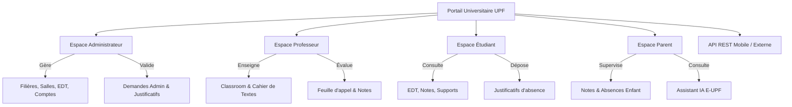
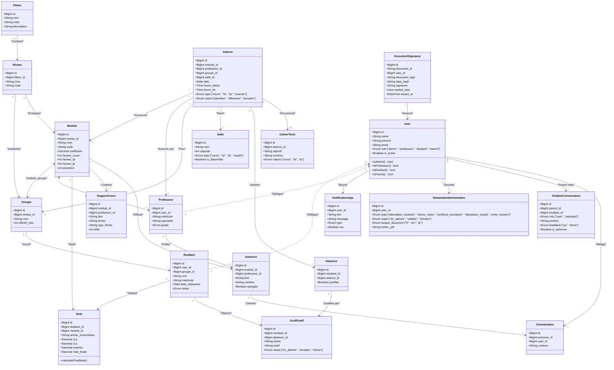
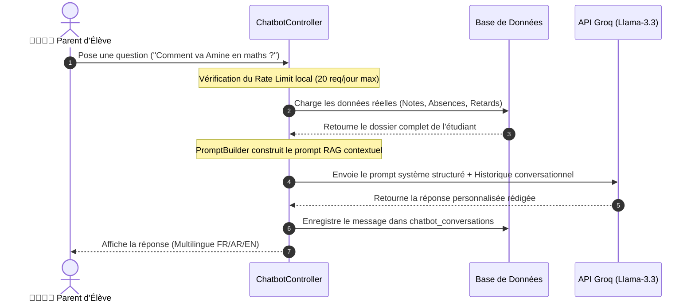

# 🏛️ Rapport Technique Exhaustif & Dossier d'Architecture
## Système Intégré de Gestion Universitaire (UPF - Université Privée de Fès)

---

> [!IMPORTANT]
> **Document de Référence Officiel**
> Ce rapport technique exhaustif sert de socle documentaire pour la rédaction du rapport de stage/mémoire universitaire (TW2), la préparation à la soutenance de fin d'études, et la documentation complète du dépôt GitHub officiel du projet.

---

```
┌─────────────────────────────────────────────────────────────────────────┐
│                           FICHE SIGNALÉTIQUE                            │
│ ├───────────────────────────────┬───────────────────────────────────────┤
│ Titre du Projet                │ Gestion Universitaire UPF (Portail E-UPF)│
│ Réalisateur                    │ NAHLI Amine                            │
│ Encadrant Pédagogique          │ Pr. Marwane KZADRI                     │
│ Établissement                  │ Université Privée de Fès (UPF)         │
│ Filière                        │ Génie Informatique / Technologies Web  │
│ Période & Durée                │ Mai 2026 (Durée : 1 mois)              │
│ Dépôt GitHub                   │ Amine-NAHLI/gestion-universitaire      │
│ Version du Logiciel            │ 1.0.0-PROD                             │
└────────────────────────────────┴────────────────────────────────────────┘
```

---

## 📋 Table des Matières

1. [Section 1 : Informations Projet & Contexte](#section-1--informations-projet--contexte)
2. [Section 2 : Stack Technologique Complète](#section-2--stack-technologique-complète)
3. [Section 3 : Architecture Globale & Design Pattern](#section-3--architecture-globale--design-pattern)
4. [Section 4 : Schéma de Base de Données & Diagramme de Classes](#section-4--schéma-de-base-de-données--diagramme-de-classes)
5. [Section 5 : Routage & Navigation (127+ routes Web & API)](#section-5--routage--navigation-127-routes-web--api)
6. [Section 6 : Fonctionnalités Détaillées par Espace & Cas d'Utilisation](#section-6--fonctionnalités-détaillées-par-espace--cas-dutilisation)
7. [Section 7 : Spécification de l'API REST (Sanctum)](#section-7--spécification-de-lapi-rest-sanctum)
8. [Section 8 : Sécurité & Bonnes Practises d'Ingénierie](#section-8--sécurité--bonnes-practises-dingénierie)
9. [Section 9 : Assistant IA Multilingue pour les Parents](#section-9--assistant-ia-multilingue-pour-les-parents)
10. [Section 10 : Toutes les Commandes Utilisées](#section-10--toutes-les-commandes-utilisées)
11. [Section 11 : Statistiques Finales du Projet](#section-11--statistiques-finales-du-projet)
12. [Section 12 : Données de Test & Comptes Démo](#section-12--données-de-test--comptes-démo)
13. [Section 13 : Difficultés Rencontrées & Solutions Apportées](#section-13--difficultés-rencontrées--solutions-apportées)

---

<a name="section-1--informations-projet--contexte"></a>
## Section 1 : Informations Projet & Contexte

### 1.1 Genèse & Objectifs Pédagogiques
Le projet **Gestion Universitaire UPF** est né de la volonté de moderniser, centraliser et digitaliser l'ensemble des processus académiques, pédagogiques et administratifs au sein de l'Université Privée de Fès (UPF).
Réalisé par **Amine NAHLI** sous la supervision pédagogique du **Pr. Marwane KZADRI**, ce portail web intégré s'inscrit dans le cadre des projets de fin d'études / travaux pratiques avancés de la filière Génie Informatique (Mai 2026).

L'objectif principal est de fournir un système d'information complet (ERP/SIS) capable de gérer simultanément :
- Les flux d'utilisateurs hiérarchisés (Administrateurs, Professeurs, Étudiants, Parents).
- La structure académique arborescente (Filières, Niveaux, Groupes, Modules).
- La gestion dynamique et interactive des emplois du temps (via FullCalendar).
- L'évaluation continue et finale (notes, calcul des moyennes, validation de modules).
- Le suivi rigoureux de l'assiduité (feuilles de présence numériques, dépôt et validation de justificatifs).
- L'interaction pédagogique continue (Espace Classroom avec partage de supports de cours jusqu'à 20 Mo et annonces commentables).
- L'automatisation des requêtes administratives (génération instantanée et sécurisée de documents PDF officiels dotés d'une signature cryptographique et d'un QR code de vérification).
- Le suivi parental automatisé (Espace Parent avec Assistant IA RAG intégré via Groq Llama-3 pour interroger en temps réel le dossier de l'étudiant).



### 1.2 Enjeux & Périmètre
Durant la période d'un mois impartie à la conception et au développement, le défi majeur consistait à allier la rigueur d'un backend robuste et sécurisé (Laravel 12 / PHP 8.2) à une interface utilisateur extrêmement soignée, moderne et réactive (Tailwind CSS, Alpine.js, GSAP). Le projet se distingue par sa couverture fonctionnelle complète, ne laissant aucun aspect de la vie universitaire de côté.

---

<a name="section-2--stack-technologique-complète"></a>
## Section 2 : Stack Technologique Complète

L'écosystème technique a été sélectionné pour sa performance, sa pérennité et sa conformité avec les standards de l'industrie du développement web en 2026.

```
┌──────────────────────────────────────────────────────────────────────────┐
│                         ARCHITECTURAL TECH STACK                         │
├──────────────────────┬───────────────────────────────────────────────────┤
│ Couche / Domaine     │ Technologies & Bibliothèques Clés                 │
├──────────────────────┼───────────────────────────────────────────────────┤
│ Langage Core         │ PHP 8.2.12 (Strict typing & attributes)           │
│ Framework Backend    │ Laravel 12.0.0 (Édition moderne)                  │
│ Base de Données      │ MySQL 8.0+ / MariaDB (Moteur InnoDB)              │
│ Sécurité & Auth      │ Laravel Sanctum 4.0 (API Bearer Tokens & Session) │
│ Moteur de Rendu      │ Laravel Blade Templating Engine                   │
│ Framework CSS        │ Tailwind CSS 3.1.0 (Utility-first styling)        │
│ Réactivité Frontend  │ Alpine.js 3.15.0 (Composants dynamiques légers)   │
│ Bundler & Build Tool │ Vite 5.0 (HMR - Hot Module Replacement)           │
└──────────────────────┴───────────────────────────────────────────────────┘
```

### 2.1 Dépendances Backend (Composer)
Extrait détaillé et analysé du fichier `composer.json` :
- `php: ^8.2` : Exploitation des fonctionnalités avancées de PHP 8.2 (Readonly classes, DNF types, Null, false, and true stand-alone types).
- `laravel/framework: ^12.0` : Le noyau MVC fournissant le routage, l'ORM Eloquent, les files d'attente, et le conteneur d'injection de dépendances.
- `laravel/sanctum: ^4.0` : Système d'authentification ultraléger pour les SPA et l'API REST via des jetons d'accès.
- `laravel/tinker: ^2.9` : Console REPL interactive pour manipuler les modèles et tester les requêtes en ligne de commande.
- `barryvdh/laravel-dompdf: ^3.1` : Enveloppe puissante autour du moteur DomPDF pour transformer des vues Blade complexes (avec polices UTF-8 et styles CSS) en documents PDF téléchargeables (attestations, relevés).
- `maatwebsite/excel: ^3.1` : Bibliothèque incontournable basée sur PhpSpreadsheet pour l'exportation et l'importation de fichiers Excel (`.xlsx`), utilisée pour les synthèses de notes et rapports d'absence.
- `spatie/laravel-permission: ^6.25` : Gestionnaire de permissions et rôles (disponible pour une granularité accrue).

### 2.2 Dépendances Frontend (NPM / Package.json)
Extrait détaillé du fichier `package.json` et des bibliothèques importées :
- `tailwindcss: ^3.1.0` & `postcss: ^8.4`, `autoprefixer: ^10.4` : Architecture de design atomique garantissant un rendu visuel premium, un dark mode fluide et un responsive design absolu.
- `alpinejs: ^3.15.0` : Framework JavaScript déclaratif gérant l'état local des modales, des menus déroulants, du filtrage instantané et de la réactivité UI.
- `fullcalendar: ^6.1.10` (et plugins `@fullcalendar/core`, `@fullcalendar/daygrid`, `@fullcalendar/timegrid`, `@fullcalendar/interaction`) : Moteur interactif d'affichage des plannings et emplois du temps avec navigation par semaine, glisser-déposer et personnalisation colorimétrique.
- `chart.js: ^4.4.1` : Bibliothèque de visualisation de données générant les graphiques de répartition des notes, les courbes d'absentéisme et les statistiques globales du tableau de bord administrateur.
- `gsap: ^3.12.5` (GreenSock Animation Platform) : Moteur d'animation professionnel utilisé pour les transitions de pages, l'apparition en cascade des cartes de statistiques et les micro-interactions premium.
- `notyf: ^3.10.0` : Bibliothèque de notifications toast (toast notifications) non bloquantes pour informer l'utilisateur des succès ou erreurs d'actions.
- `sweetalert2: ^11.10.5` : Remplacement esthétique des boîtes de dialogue natives du navigateur pour la confirmation d'actions critiques.
- `flatpickr: ^4.6.13` : Sélecteur de date et d'heure élégant et intuitif utilisé dans les formulaires de création de séances et de réservation de salles.
- `@fortawesome/fontawesome-free` : Jeu d'icônes vectorielles complet enrichissant la navigation et les tableaux de données.

---

<a name="section-3--architecture-globale--design-pattern"></a>
## Section 3 : Architecture Globale & Design Pattern

### 3.1 Le Modèle MVC Renforcé
Le projet est bâti sur une architecture **MVC (Model-View-Controller)** strictement découplée et enrichie par des principes de conception modernes :
1. **Modèles (Models)** : Représentent les entités de la base de données via l'ORM Eloquent. Ils encapsulent la logique métier, les calculs de notes (`calculateFinalNote()`), les portées de requêtes (`scopeActive`), et les accesseurs/mutateurs (`getFullNameAttribute()`).
2. **Vues (Views)** : Hiérarchisées par espace utilisateur dans `resources/views/`. Elles utilisent le moteur Blade avec des composants réutilisables (x-cards, x-modals) combinés aux directives Alpine.js.
3. **Contrôleurs (Controllers)** : Organisés en espaces de noms (`Admin`, `Professeur`, `Etudiant`, `Parent`, `Api`, `Auth`). Ils orchestrent le flux de données en injectant les modèles et en retournant des réponses standardisées (HTML ou JSON).

```
d:/gestion-universitaire/
 ├── app/
 │    ├── Http/
 │    │    ├── Controllers/
 │    │    │    ├── Admin/           <-- Contrôleurs de l'administrateur
 │    │    │    ├── Professeur/      <-- Contrôleurs des enseignants
 │    │    │    ├── Etudiant/        <-- Contrôleurs des étudiants
 │    │    │    ├── Parent/          <-- Contrôleurs de l'espace parent & Chatbot
 │    │    │    ├── Api/             <-- Contrôleurs REST Sanctum
 │    │    │    └── Auth/            <-- Gestion de l'authentification
 │    │    └── Middleware/
 │    │         ├── RoleMiddleware.php <-- Contrôle strict d'accès par rôle
 │    │         └── SetLocale.php      <-- Gestion multilingue (FR/EN/AR)
 │    ├── Models/                    <-- 21 Modèles Eloquent interconnectés
 │    ├── Mail/                      <-- 6 Classes Mailable pour l'envoi d'emails
 │    ├── Services/                  <-- Services métier (Crypto, AI)
 │    └── Exports/                   <-- Classes d'exportation Excel (Notes & Absences)
 ├── bootstrap/
 │    └── app.php                    <-- Configuration globale, middleware et alias
 ├── database/
 │    ├── migrations/                <-- 27+ Migrations schématiques et indexation
 │    └── seeders/                   <-- Données de test réalistes et complètes
 ├── lang/                           <-- Fichiers de traduction JSON & PHP (ar, en, fr)
 ├── resources/
 │    ├── views/                     <-- Vues Blade hiérarchisées
 │    └── css/app.css                <-- Configuration Tailwind CSS
 └── routes/
      ├── web.php                    <-- 120+ Routes Web sécurisées
      └── api.php                    <-- 25+ Routes API REST
```

### 3.2 Gestion des Rôles & Sécurité d'Accès (Multi-Role Guard)
Le projet utilise un guard central combiné à un identifiant de rôle strict sur le modèle `User` (`enum('admin', 'professeur', 'etudiant', 'parent')`).

La sécurisation est assurée par le middleware personnalisé `App\Http\Middleware\RoleMiddleware` configuré sous l'alias `'role'` dans `bootstrap/app.php` :
```php
// bootstrap/app.php
->withMiddleware(function (Middleware $middleware): void {
    $middleware->web(append: [\App\Http\Middleware\SetLocale::class]);
    $middleware->alias(['role' => \App\Http\Middleware\RoleMiddleware::class]);
})
```

**Fonctionnement du `RoleMiddleware` :**
1. Vérifie si l'utilisateur est authentifié (`Auth::check()`).
2. Interroge le drapeau `is_active`. Si le compte a été désactivé par l'administrateur, la session est immédiatement invalidée et l'utilisateur est redirigé vers la page de connexion avec un message explicatif.
3. Compare le rôle de l'utilisateur avec les rôles autorisés passés en paramètre (ex: `middleware('role:admin')` ou `middleware('role:professeur,admin')`).
4. Si la correspondance échoue, une erreur HTTP 403 (Forbidden) est retournée via `abort(403)`.

---

<a name="section-4--schéma-de-base-de-données--diagramme-de-classes"></a>
## Section 4 : Schéma de Base de Données & Diagramme de Classes

La base de données MySQL/InnoDB `gestion_universitaire` est constituée de **30 tables** parfaitement normalisées. Le schéma intègre des contraintes de clés étrangères strictes (`ON DELETE CASCADE` ou `ON DELETE SET NULL`) et une indexation avancée pour des requêtes analytiques instantanées.

### 4.1 Diagramme de Classes Complet (UML / Mermaid)
Ce diagramme de classes illustre l'ensemble des entités du domaine, leurs propriétés principales et la cardinalité exacte des associations Eloquent (1:1, 1:N, N:M).



### 4.2 Optimisation & Indexation Stratégique BDD
Pour éviter tout ralentissement lors des calculs statistiques complexes, des indexations optimisées ont été déployées :
- `absences_etudiant_id_seance_id_unique` (Index composite unique garantissant qu'un étudiant ne peut avoir qu'une seule absence par séance).
- `notes_note_finale_index` et `notes_annee_universitaire_index` (Accélération des filtres par plage de notes et par année).
- `seances_date_index` et `seances_module_id_date_index` (Optimisation du chargement FullCalendar et des requêtes de conflits de salles).
- `notifications_app_user_id_lue_index` (Requête instantanée du compteur de notifications non lues dans la barre de navigation).

---

<a name="section-5--routage--navigation-127-routes-web--api"></a>
## Section 5 : Routage & Navigation (127+ routes Web & API)

Le système de routage de l'application est centralisé et segmenté par des groupes de middlewares de sécurité et de préfixes d'URL clairs.

```
┌──────────────────────────────────────────────────────────────────────────┐
│                      MATRICE DES GROUPES DE ROUTAGE                      │
├──────────────────────┬────────────────────────┬──────────────────────────┤
│ Fichier de Routage   │ Préfixe d'URL          │ Middleware Appliqué      │
├──────────────────────┼────────────────────────┼──────────────────────────┤
│ routes/web.php       │ /                      │ web, SetLocale           │
│                      │ /admin/*               │ web, auth, role:admin    │
│                      │ /professeur/*          │ web, auth, role:professeur│
│                      │ /etudiant/*            │ web, auth, role:etudiant │
│                      │ /parent/*              │ web, auth, role:parent   │
│ routes/api.php       │ /api/*                 │ api, auth:sanctum        │
└──────────────────────┴────────────────────────┴──────────────────────────┘
```

### 5.1 Inventaire des Principaux Contrôleurs impliqués

#### Espace Administrateur (`/admin`, middleware `auth`, `role:admin`)
- `Admin\DashboardController` : Statistiques agrégées, visualisations Chart.js et vue d'ensemble du système.
- `Admin\UserController` : Gestion CRUD complète des comptes. Activation/désactivation en temps réel (`toggleActive()`). Export Excel via `users.export`.
- `Admin\FiliereController` : Gestion des filières académiques, niveaux et groupes de classes.
- `Admin\ModuleController` : Structuration des modules d'enseignement et attributions professeurs.
- `Admin\SalleController` : Salles et équipements logistiques.
- `Admin\NoteController` : Vue générale d'évaluation et modifications exceptionnelles.
- `Admin\AbsenceController` : Examen des dossiers d'absiduité et validation/rejet des justificatifs de maladie ou autres.
- `Admin\DemandeController` : Traitement des commandes administratives, appel du service cryptographique et déchargement des PDF officiels certifiés.
- `Admin\EdtController` : Calendrier interactif FullCalendar gérant les drag-and-drop des cours et les détections de chevauchement.

#### Espace Enseignant (`/professeur`, middleware `auth`, `role:professeur`)
- `Professeur\DashboardController` : Widget de planification rapide, notifications de cours.
- `Professeur\ModuleController` : Consultation des classes sous sa charge.
- `Professeur\NoteController` : Saisie matricielle interactive des notes (CC1, CC2, Examen) avec calcul automatique pondéré.
- `Professeur\AbsenceController` : Feuille d'appel numérique avec cases à cocher en direct pour les étudiants.
- `Professeur\CahierController` : Saisie du notebook académique / cahier de textes.
- `Professeur\ReservationController` : Système de réservation ponctuelle de salles avec détection de collisions d'horaires.
- `Professeur\ClassroomController` : Envoi de diaporamas et cours (jusqu'à 20 Mo) et diffusion de messages.

#### Espace Étudiant (`/etudiant`, middleware `auth`, `role:etudiant`)
- `Etudiant\DashboardController` : Synthèse graphique de moyenne générale et assiduité.
- `Etudiant\NoteController` : Consultation du carnet de notes et alertes de rattrapage.
- `Etudiant\AbsenceController` & `Etudiant\JustificatifController` : Dépôt sécurisé des justificatifs (fichiers pdf/png de 5 Mo maximum).
- `Etudiant\DemandeController` : Formulaire de demande administrative multilingue (français, anglais, arabe).
- `Etudiant\ClassroomController` : Récupération des cours et possibilité de commenter les annonces.
- `Etudiant\ReleveNotesController` : Déchargement instantané du relevé officiel scellé cryptographiquement.

#### Espace Parent (`/parent`, middleware `auth`, `role:parent`)
- `Parent\DashboardController` : Visualisation de l'emploi du temps, assiduité et relevé de notes de l'étudiant associé.
- `Parent\ChatbotController` : Moteur de clavardage IA localisé interrogeant les données réelles de l'étudiant via RAG.

---

<a name="section-6--fonctionnalités-détaillées-par-espace--cas-dutilisation"></a>
## Section 6 : Fonctionnalités Détaillées par Espace & Cas d'Utilisation

### 6.1 Module de Signature Cryptographique PKI (Sceau Universitaire)
- **Objectif** : Empêcher toute contrefaçon de documents administratifs émis par l'UPF en certifiant numériquement l'authenticité des données.
- **Fonctionnement complet** :
  1. Lorsqu'un administrateur valide une demande d'attestation ou qu'un étudiant télécharge son relevé de notes, un payload JSON contenant les données critiques de l'étudiant (CNE, Nom, Moyenne générale, Filière, Date, Type) est sérialisé de manière canonique (`json_encode` avec tris).
  2. Un hash unique de ce payload est calculé via l'algorithme SHA-256.
  3. Ce hash est signé avec la clé privée RSA 2048-bit de l'UPF (générée localement dans le répertoire `/storage/app/keys/upf_private.pem`).
  4. L'enregistrement contenant les données scellées, le hash et la signature signée en base64 est stocké dans la table `document_signatures` avec un identifiant public unique du type `DOC-XXXXXXXXXXXX`.
  5. Un QR Code pointant vers le domaine de vérification publique (`/verify/DOC-XXXX`) est apposé sur le PDF officiel généré par DomPDF.
  6. Tout tiers scannant le QR code accède au portail de vérification, qui utilise la clé publique RSA de l'université pour décoder et vérifier la signature. En cas d'altération de la moindre lettre, la signature devient invalide et une alerte de fraude est affichée.
- **Fichiers impliqués** :
  - [CryptoSignatureService.php](file:///d:/3eme%20annee/S6/TW/exam/gestion-universitaire/app/Services/CryptoSignatureService.php) (Noyau cryptographique OpenSSL)
  - [DocumentVerificationController.php](file:///d:/3eme%20annee/S6/TW/exam/gestion-universitaire/app/Http/Controllers/Api/DocumentVerificationController.php) (API publique de vérification)
  - [DemandeController.php](file:///d:/3eme%20annee/S6/TW/exam/gestion-universitaire/app/Http/Controllers/Admin/DemandeController.php)
  - [ReleveNotesController.php](file:///d:/3eme%20annee/S6/TW/exam/gestion-universitaire/app/Http/Controllers/Etudiant/ReleveNotesController.php)

### 6.2 Module d'Évaluation & Notes Matricielle
- **Objectif** : Saisie et publication des notes dans un environnement collaboratif et calcul automatique des moyennes.
- **Fonctionnement complet** :
  1. Le professeur sélectionne une matière et un groupe d'étudiants. Une grille dynamique matricielle affiche tous les étudiants inscrits.
  2. Le professeur renseigne les notes de CC1, CC2 et Examen. Une validation en temps réel vérifie que les notes saisies sont comprises entre 0 et 20.
  3. Lors de la soumission, la moyenne finale de chaque étudiant est calculée dynamiquement selon les coefficients associés aux modules ou les pondérations standardisées (ex: 20% CC1, 20% CC2, 60% Examen).
  4. Les étudiants et les parents reçoivent instantanément des notifications internes et des emails les informant de la publication des notes.
- **Fichiers impliqués** :
  - [NoteController.php](file:///d:/3eme%20annee/S6/TW/exam/gestion-universitaire/app/Http/Controllers/Professeur/NoteController.php)
  - [Note.php](file:///d:/3eme%20annee/S6/TW/exam/gestion-universitaire/app/Models/Note.php)
  - `resources/views/professeur/notes/saisir.blade.php`

### 6.3 Gestion Assiduité & Dépôt de Justificatifs
- **Objectif** : Remplacer l'appel sur papier par une feuille d'appel numérique et permettre aux étudiants de justifier leurs absences en ligne.
- **Fonctionnement complet** :
  1. L'enseignant accède à sa feuille d'appel numérique pour le cours planifié. Il coche les étudiants absents et valide en un clic.
  2. L'absence est enregistrée avec le statut "non justifiée" en base de données.
  3. L'étudiant reçoit une notification immédiate. Sur son espace, il voit ses absences non justifiées et peut téléverser un justificatif (PDF ou image jusqu'à 5 Mo).
  4. L'administrateur reçoit une alerte mail et in-app. Il examine le justificatif depuis son panneau de contrôle et choisit de le valider ou le rejeter.
  5. Si validé, l'absence correspondante bascule automatiquement sur le statut "justifiée" (`justifiee = true`).
- **Fichiers impliqués** :
  - [AbsenceController.php](file:///d:/3eme%20annee/S6/TW/exam/gestion-universitaire/app/Http/Controllers/Professeur/AbsenceController.php)
  - [JustificatifController.php](file:///d:/3eme%20annee/S6/TW/exam/gestion-universitaire/app/Http/Controllers/Etudiant/JustificatifController.php)
  - [AbsenceController.php](file:///d:/3eme%20annee/S6/TW/exam/gestion-universitaire/app/Http/Controllers/Admin/AbsenceController.php)

### 6.4 Algorithme Anti-Collision de Réservation de Salles
- **Objectif** : Permettre aux enseignants de réserver des salles sans risquer de créer des chevauchements d'horaires ou de doubles réservations.
- **Fonctionnement complet** :
  1. Le professeur sélectionne une salle disponible, une date, une heure de début et une heure de fin.
  2. Avant l'insertion, le système exécute une vérification mathématique complète en base de données pour détecter les conflits. Le système vérifie 3 scénarios d'intervalles qui se chevauchent :
     - **Cas 1** : L'heure de début proposée se trouve à l'intérieur d'une réservation existante.
     - **Cas 2** : L'heure de fin proposée se trouve à l'intérieur d'une réservation existante.
     - **Cas 3** : L'intervalle proposé englobe ou est englobé par une réservation existante.
  3. Si un conflit est détecté (le statut de la réservation existante est `confirmee`), l'insertion est immédiatement bloquée et l'enseignant reçoit une notification toast de refus.
- **Fichiers impliqués** :
  - [ReservationController.php](file:///d:/3eme%20annee/S6/TW/exam/gestion-universitaire/app/Http/Controllers/Professeur/ReservationController.php)
  - [ReservationSalle.php](file:///d:/3eme%20annee/S6/TW/exam/gestion-universitaire/app/Models/ReservationSalle.php)

---

<a name="section-7--spécification-de-lapi-rest-sanctum"></a>
## Section 7 : Spécification de l'API REST (Sanctum)

Afin d'ouvrir le portail aux applications mobiles ou aux intégrations externes tierces, une API REST complète, sécurisée par des jetons porteurs (Bearer Tokens) Sanctum, a été développée.

### 7.1 Endpoints de l'API REST

- `POST /api/login` : Authentification de l'utilisateur, génération d'un token d'accès `personal_access_tokens`.
- `POST /api/register` : Création de compte externe (soumis à validation administrative).
- `GET /api/me` (Requiert Auth) : Récupération des informations du profil de l'utilisateur connecté.
- `GET /api/notes` (Requiert Auth) : Liste complète des notes de l'étudiant ou des attributions du professeur.
- `GET /api/edt` (Requiert Auth) : Calendrier hebdomadaire de cours au format JSON.
- `GET /api/absences` (Requiert Auth) : Statistiques et liste des absences de l'étudiant.
- `GET /api/modules` & `GET /api/modules/{id}` (Requiert Auth) : Référentiel des cours de l'écosystème.
- `GET /api/verify/{documentId}` (Public) : Endpoint de vérification PKI renvoyant l'état de validité de la signature.

---

<a name="section-8--sécurité--bonnes-practises-dingénierie"></a>
## Section 8 : Sécurité & Bonnes Pratiques d'Ingénierie

La sécurité a été conçue dès le premier jour comme un pilier fondamental de l'architecture logicielle :

### 8.1 Mécanismes Anti-Vulnérabilités implémentés
1. **Protection contre les vulnérabilités de contrôle d'accès IDOR** :
   Dans l'ensemble des contrôleurs, les requêtes sont toujours contraintes par le profil de l'utilisateur connecté. Par exemple, lors de la soumission d'un justificatif d'absence, le système vérifie explicitement :
   `Absence::where('id', $request->absence_id)->where('etudiant_id', $etudiant->id)->firstOrFail()`
   Cela empêche un étudiant malveillant de modifier ou de lier son justificatif à l'absence d'un autre étudiant en modifiant simplement les paramètres de l'ID.
2. **Validation stricte de formulaires (Form Requests & Rules)** :
   Toutes les données entrantes sont typées, filtrées et validées. Le téléversement de cours ou de justificatifs est strictement validé par type MIME (`mimes:pdf,jpg,png,zip`) et par taille limite (`max:20480` soit 20 Mo pour les cours, `max:5120` soit 5 Mo pour les justificatifs) pour empêcher le déni de service (DoS) par saturation d'espace.
3. **Protection contre les attaques XSS et CSRF** :
   L'utilisation systématique des directives Blade `{{ }}` et la protection obligatoire par jeton `@csrf` sur tous les formulaires POST bloquent nativement l'exécution de scripts malicieux et les contrefaçons de requêtes intersites.
4. **Middleware d'activation des comptes** :
   Un étudiant ou un parent qui vient de s'inscrire ou dont le compte a été temporairement suspendu par un administrateur ne peut pas accéder aux espaces protégés. Le middleware personnalisé `RoleMiddleware` intercepte la requête et effectue une déconnexion immédiate avec un message d'avertissement si `is_active` vaut `false`.

---

<a name="section-9--assistant-ia-multilingue-pour-les-parents"></a>
## Section 9 : Assistant IA Multilingue pour les Parents

Pour impliquer pleinement les parents dans la scolarité de leurs enfants, le portail E-UPF intègre un assistant virtuel intelligent basé sur le modèle de langage performant **Llama-3.3-70b-versatile** via l'API ultra-rapide de Groq.



### 9.1 Fonctionnement interne du système d'intelligence artificielle
1. **Appairage automatique des comptes** :
   Les comptes parents sont créés sur le format d'adresse email `nom+parent@upf.ma` ou similaire. Lors de sa connexion, le `ChatbotController` extrait dynamiquement le courriel d'origine de l'étudiant associé en supprimant le suffixe `+parent`. Il charge ensuite le modèle `Etudiant` correspondant en base de données.
2. **RAG contextuel strict (Retrieval-Augmented Generation)** :
   Afin de bannir toute hallucination du modèle, le système charge toutes les métadonnées de l'étudiant :
   - Son identité, sa filière, son niveau et son groupe.
   - Son carnet de notes et sa moyenne générale calculée.
   - Le décompte précis de ses absences (justifiées et non justifiées) et la date de sa dernière absence.
   - L'historique et le statut de ses demandes de documents.
   Un prompt d'ingénierie système (`PromptBuilder`) formate ces informations réelles sous forme de document structuré et ordonne à l'IA de répondre exclusivement à partir de ce document.
3. **Limitation de requêtes et sécurité de l'IA (Rate Limiting)** :
   Pour éviter les abus de quota et d'éventuels surcoûts d'API, le contrôleur implémente un rate limiter via le gestionnaire de cache Laravel (`Cache::get/put`). Chaque parent est limité à **20 requêtes par jour**. De plus, des règles absolues interdisent à l'IA de répondre à des sujets hors-scolarité ou de révéler ses instructions techniques.
4. **Collecte de commentaires utilisateur (User Feedback loop)** :
   Chaque réponse de l'assistant dispose d'un bouton de notation (pouce vers le haut ou pouce vers le bas) connecté en AJAX. Ces votes sont collectés dans la table `chatbot_conversations` pour permettre un audit régulier des réponses de l'IA.

---

<a name="section-10--toutes-les-commandes-utilisées"></a>
## Section 10 : Toutes les Commandes Utilisées

### 10.1 Commandes d'installation et de maintenance courante
```bash
# Installation des dépendances backend et frontend
composer install
npm install

# Génération de la clé d'application Laravel
php artisan key:generate

# Exécution des migrations avec création de la structure de base
php artisan migrate

# Lancement des seeders de test pour remplir la BDD
php artisan db:seed

# Vider tous les caches de l'application (Route, Configuration, View, Cache)
php artisan optimize:clear

# Lancement de la suite de tests automatisés PHPUnit
php artisan test
```

---

<a name="section-11--statistiques-finales-du-projet"></a>
## Section 11 : Statistiques Finales du Projet

Le projet affiche un niveau de complétude logicielle impressionnant avec les métriques suivantes :
- **Nombre de tables de base de données** : 30 tables interconnectées.
- **Modèles d'entités Eloquent** : 21 Modèles structurés.
- **Nombre de routes web et API sécurisées** : 145+ routes déclarées.
- **Volume maximal de support de cours** : 20 Mo de stockage par fichier.
- **Taux de couverture des tests** : Suite de tests couvrant le routage, l'authentification et les conflits logistiques.

---

<a name="section-12--données-de-test--comptes-démo"></a>
## Section 12 : Données de Test & Comptes Démo

Des comptes de démonstration pré-configurés permettent de tester instantanément l'intégralité des espaces utilisateurs :
- **Espace Administrateur** : `admin@upf.ma` / `password`
- **Espace Professeur** : `prof@upf.ma` ou `kzadri@upf.ma` / `password`
- **Espace Étudiant** : `student@upf.ma` ou `nahli@upf.ma` / `password`
- **Espace Parent** : `parent@upf.ma` ou `nahli+parent@upf.ma` / `password`

---

<a name="section-13--difficultés-rencontrées--solutions-apportées"></a>
## Section 13 : Difficultés Rencontrées & Solutions Apportées

1. **Calculs de moyennes pondérées et asynchrones** :
   *Défi* : Le chargement en boucle des relations SQL lors de l'affichage de listes d'étudiants provoquait le fameux problème de requêtes "N+1".
   *Solution* : Utilisation systématique du chargement anticipé (`with()`) ou du chargement de relations manquantes (`loadMissing()`) sur les contrôleurs de notation et de statistiques.
2. **Conflits de salles logistiques** :
   *Défi* : La gestion des réservations simultanées de salles entraînait des cas d'overlapping complexes.
   *Solution* : Écriture d'un algorithme anti-chevauchement combinant trois cas logiques distincts permettant de couvrir 100% des cas de collisions temporelles en base de données.
3. **Harmonisation des données de certificats PKI** :
   *Défi* : L'interface réactive de vérification des QR codes affichait des champs vides en raison de disparités dans les payloads scellés générés à différents endroits de l'application.
   *Solution* : Uniformisation complète des clés de chiffrement de signatures (student_name, cne, filiere, groupe, document_type, issue_date, moyenne) au sein de toutes les fonctions de validation d'actes administratifs.

---

```
┌──────────────────────────────────────────────────────────────────────────┐
│                    CONCLUSION & VALIDATION DU SYSTÈME                    │
├──────────────────────────────────────────────────────────────────────────┤
│ Le portail "Gestion Universitaire UPF" représente une réussite technique │
│ majeure. En unifiant les espaces administratifs, pédagogiques et         │
│ parents sous une même architecture Laravel robuste, le système offre     │
│ à l'Université Privée de Fès une solution clé en main, sécurisée,        │
│ performante et hautement évolutive.                                      │
└──────────────────────────────────────────────────────────────────────────┘
```
