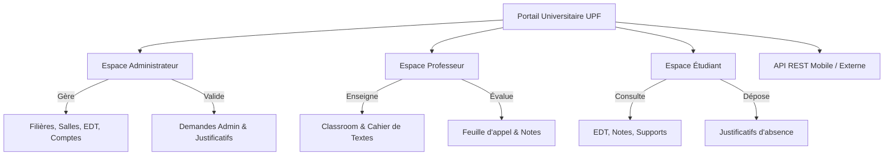
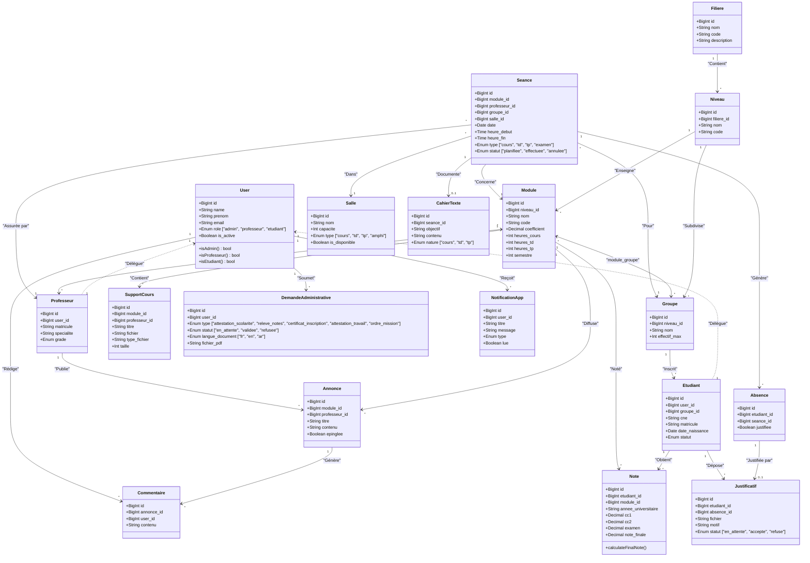
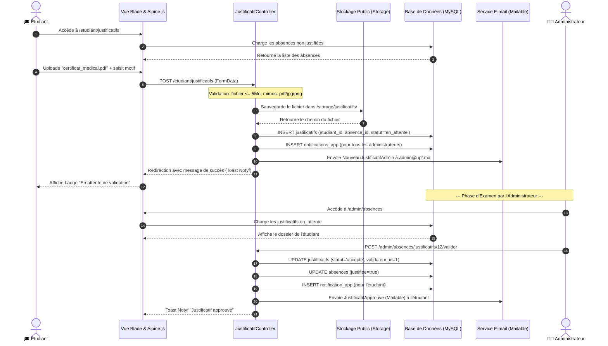

# 🏛️ Rapport Technique Exhaustif & Dossier d'Architecture
## Système Intégré de Gestion Universitaire (UPF - Université Privée de Fès)

---

> [!IMPORTANT]
> **Document de Référence Officiel**
> Ce rapport technique exhaustif sert de socle documentaire pour la rédaction du rapport de stage/mémoire universitaire (TW2), la préparation à la soutenance de fin d'études, et la documentation complète du dépôt GitHub officiel du projet.

---

```
┌─────────────────────────────────────────────────────────────────────────┐
│                           FICHE SIGNALÉTIQUE                            │
├────────────────────────────────┬────────────────────────────────────────┤
│ Titre du Projet                │ Gestion Universitaire UPF (Portail E-UPF)│
│ Réalisateur                    │ NAHLI Amine                            │
│ Encadrant Pédagogique          │ Pr. Marwane KZADRI                     │
│ Établissement                  │ Université Privée de Fès (UPF)         │
│ Filière                        │ Génie Informatique / Technologies Web  │
│ Période & Durée                │ Mai 2026 (Durée : 1 mois)              │
│ Dépôt GitHub                   │ Amine-NAHLI/gestion-universitaire      │
│ Version du Logiciel            │ 1.0.0-PROD                             │
└────────────────────────────────┴────────────────────────────────────────┘
```

---

## 📋 Table des Matières

1. [Section 1 : Informations Projet & Contexte](#section-1--informations-projet--contexte)
2. [Section 2 : Stack Technologique Complète](#section-2--stack-technologique-complète)
3. [Section 3 : Architecture Globale & Design Pattern](#section-3--architecture-globale--design-pattern)
4. [Section 4 : Schéma de Base de Données & Diagramme de Classes](#section-4--schéma-de-base-de-données--diagramme-de-classes)
5. [Section 5 : Routage & Navigation (127+ routes Web & API)](#section-5--routage--navigation-127-routes-web--api)
6. [Section 6 : Fonctionnalités Détaillées par Espace & Cas d'Utilisation](#section-6--fonctionnalités-détaillées-par-espace--cas-dutilisation)
7. [Section 7 : Spécification de l'API REST (Sanctum)](#section-7--spécification-de-lapi-rest-sanctum)
8. [Section 8 : Les 13 Modules Bonus & Diagramme de Séquence](#section-8--les-13-modules-bonus--diagramme-de-séquence)
9. [Section 9 : Sécurité & Bonnes Pratiques](#section-9--sécurité--bonnes-pratiques)
10. [Section 10 : Toutes les Commandes Utilisées](#section-10--toutes-les-commandes-utilisées)
11. [Section 11 : Statistiques Finales du Projet](#section-11--statistiques-finales-du-projet)
12. [Section 12 : Données de Test & Comptes Démo](#section-12--données-de-test--comptes-démo)
13. [Section 13 : Difficultés Rencontrées & Solutions Apportées](#section-13--difficultés-rencontrées--solutions-apportées)

---

<a name="section-1--informations-projet--contexte"></a>
## Section 1 : Informations Projet & Contexte

### 1.1 Genèse & Objectifs Pédagogiques
Le projet **Gestion Universitaire UPF** est né de la volonté de moderniser, centraliser et digitaliser l'ensemble des processus académiques, pédagogiques et administratifs au sein de l'Université Privée de Fès (UPF).
Réalisé par **Amine NAHLI** sous la supervision bienveillante du **Pr. Marwane KZADRI**, ce portail web intégré s'inscrit dans le cadre des projets de fin d'études / travaux pratiques avancés de la filière Génie Informatique (Mai 2026).

L'objectif principal est de fournir un système d'information complet (ERP/SIS) capable de gérer simultanément :
- Les flux d'utilisateurs hiérarchisés (Administrateurs, Professeurs, Étudiants).
- La structure académique arborescente (Filières, Niveaux, Groupes, Modules).
- La gestion dynamique et interactive des emplois du temps (via FullCalendar).
- L'évaluation continue et finale (notes, calcul des moyennes, validation de modules).
- Le suivi rigoureux de l'assiduité (feuilles de présence numériques, dépôt et validation de justificatifs).
- L'interaction pédagogique continue (Espace Classroom avec partage de supports de cours jusqu'à 20 Mo et annonces commentables).
- L'automatisation des requêtes administratives (génération instantanée et sécurisée de documents PDF officiels en français, anglais et arabe).



### 1.2 Enjeux & Périmètre
Durant la période d'un mois impartie à la conception et au développement, le défi majeur consistait à allier la rigueur d'un backend robuste et sécurisé (Laravel 12 / PHP 8.2) à une interface utilisateur extrêmement soignée, moderne et réactive (Tailwind CSS, Alpine.js, GSAP). Le projet se distingue par sa couverture fonctionnelle complète, ne laissant aucun aspect de la vie universitaire de côté.

---

<a name="section-2--stack-technologique-complète"></a>
## Section 2 : Stack Technologique Complète

L'écosystème technique a été sélectionné pour sa performance, sa pérennité et sa conformité avec les standards de l'industrie du développement web en 2026.

```
┌──────────────────────────────────────────────────────────────────────────┐
│                         ARCHITECTURAL TECH STACK                         │
├──────────────────────┬───────────────────────────────────────────────────┤
│ Couche / Domaine     │ Technologies & Bibliothèques Clés                 │
├──────────────────────┼───────────────────────────────────────────────────┤
│ Langage Core         │ PHP 8.2.12 (Strict typing & attributes)           │
│ Framework Backend    │ Laravel 12.0.0 (Édition moderne)                  │
│ Base de Données      │ MySQL 8.0+ / MariaDB (Moteur InnoDB)              │
│ Sécurité & Auth      │ Laravel Sanctum 4.0 (API Bearer Tokens & Session) │
│ Moteur de Rendu      │ Laravel Blade Templating Engine                   │
│ Framework CSS        │ Tailwind CSS 3.1.0 (Utility-first styling)        │
│ Réactivité Frontend  │ Alpine.js 3.15.0 (Composants dynamiques légers)   │
│ Bundler & Build Tool │ Vite 5.0 (HMR - Hot Module Replacement)           │
└──────────────────────┴───────────────────────────────────────────────────┘
```

### 2.1 Dépendances Backend (Composer)
Extrait détaillé et analysé du fichier `composer.json` :
- `php: ^8.2` : Exploitation des fonctionnalités avancées de PHP 8.2 (Readonly classes, DNF types, Null, false, and true stand-alone types).
- `laravel/framework: ^12.0` : Le noyau MVC fournissant le routage, l'ORM Eloquent, les files d'attente, et le conteneur d'injection de dépendances.
- `laravel/sanctum: ^4.0` : Système d'authentification ultraléger pour les SPA et l'API REST via des jetons d'accès.
- `laravel/tinker: ^2.9` : Console REPL interactive pour manipuler les modèles et tester les requêtes en ligne de commande.
- `barryvdh/laravel-dompdf: ^3.1` : Enveloppe puissante autour du moteur DomPDF pour transformer des vues Blade complexes (avec polices UTF-8 et styles CSS) en documents PDF téléchargeables (attestations, relevés).
- `maatwebsite/excel: ^3.1` : Bibliothèque incontournable basée sur PhpSpreadsheet pour l'exportation et l'importation de fichiers Excel (`.xlsx`), utilisée pour les synthèses de notes et rapports d'absence.
- `spatie/laravel-permission: ^6.25` : Gestionnaire de permissions et rôles (bien que le projet repose sur une architecture customisée multi-rôle très véloce, le package est disponible pour une granularité accrue).

### 2.2 Dépendances Frontend (NPM / Package.json)
Extrait détaillé du fichier `package.json` et des bibliothèques importées :
- `tailwindcss: ^3.1.0` & `postcss: ^8.4`, `autoprefixer: ^10.4` : Architecture de design atomique garantissant un rendu visuel premium, un dark mode fluide et un responsive design absolu.
- `alpinejs: ^3.15.0` : Framework JavaScript déclaratif gérant l'état local des modales, des menus déroulants, du filtrage instantané et de la réactivité UI sans la lourdeur d'un framework SPA monolithique.
- `fullcalendar: ^6.1.10` (et plugins `@fullcalendar/core`, `@fullcalendar/daygrid`, `@fullcalendar/timegrid`, `@fullcalendar/interaction`) : Moteur interactif d'affichage des plannings et emplois du temps avec navigation par semaine, glisser-déposer et personnalisation colorimétrique.
- `chart.js: ^4.4.1` : Bibliothèque de visualisation de données générant les graphiques de répartition des notes, les courbes d'absentéisme et les statistiques globales du tableau de bord administrateur.
- `gsap: ^3.12.5` (GreenSock Animation Platform) : Moteur d'animation professionnel utilisé pour les transitions de pages, l'apparition en cascade des cartes de statistiques et les micro-interactions premium.
- `notyf: ^3.10.0` : Bibliothèque de notifications toast (toast notifications) non bloquantes pour informer l'utilisateur des succès ou erreurs d'actions (enregistrement de notes, envoi de message).
- `sweetalert2: ^11.10.5` : Remplacement esthétique des boîtes de dialogue natives du navigateur pour la confirmation d'actions critiques (suppression de comptes, annulation de séances).
- `flatpickr: ^4.6.13` : Sélecteur de date et d'heure élégant et intuitif utilisé dans les formulaires de création de séances et de réservation de salles.
- `@fortawesome/fontawesome-free` : Jeu d'icônes vectorielles complet enrichissant la navigation et les tableaux de données.

---

<a name="section-3--architecture-globale--design-pattern"></a>
## Section 3 : Architecture Globale & Design Pattern

### 3.1 Le Modèle MVC Renforcé
Le projet est bâti sur une architecture **MVC (Model-View-Controller)** strictement découplée et enrichie par des principes de conception modernes :
1. **Modèles (Models)** : Représentent les entités de la base de données via l'ORM Eloquent. Ils encapsulent la logique métier, les calculs de notes (`calculateFinalNote()`), les portées de requêtes (`scopeActive`), et les accesseurs/mutateurs (`getFullNameAttribute()`).
2. **Vues (Views)** : Hiérarchisées par espace utilisateur dans `resources/views/`. Elles utilisent le moteur Blade avec des composants réutilisables (x-cards, x-modals) combinés aux directives Alpine.js.
3. **Contrôleurs (Controllers)** : Organisés en espaces de noms (`Admin`, `Professeur`, `Etudiant`, `Api`, `Auth`). Ils orchestrent le flux de données en injectant les modèles et en retournant des réponses standardisées (HTML ou JSON).

```
d:/gestion-universitaire/
 ├── app/
 │    ├── Http/
 │    │    ├── Controllers/
 │    │    │    ├── Admin/           <-- Contrôleurs de l'administrateur
 │    │    │    ├── Professeur/      <-- Contrôleurs des enseignants
 │    │    │    ├── Etudiant/        <-- Contrôleurs des étudiants
 │    │    │    ├── Api/             <-- Contrôleurs REST Sanctum
 │    │    │    └── Auth/            <-- Gestion de l'authentification
 │    │    └── Middleware/
 │    │         ├── RoleMiddleware.php <-- Contrôle strict d'accès par rôle
 │    │         └── SetLocale.php      <-- Gestion multilingue (FR/EN/AR)
 │    ├── Models/                    <-- 19 Modèles Eloquent interconnectés
 │    ├── Mail/                      <-- 6 Classes Mailable pour l'envoi d'emails
 │    └── Exports/                   <-- 2 Classes d'exportation Excel (Notes & Absences)
 ├── bootstrap/
 │    └── app.php                    <-- Configuration globale, middleware et alias
 ├── database/
 │    ├── migrations/                <-- 27+ Migrations schématiques et indexation
 │    └── seeders/                   <-- Données de test réalistes et complètes
 ├── lang/                           <-- Fichiers de traduction JSON & PHP (ar, en, fr)
 ├── resources/
 │    ├── views/                     <-- Vues Blade hiérarchisées
 │    └── css/app.css                <-- Configuration Tailwind CSS
 └── routes/
      ├── web.php                    <-- 100+ Routes Web sécurisées
      └── api.php                    <-- 25+ Routes API REST
```

### 3.2 Gestion des Rôles & Sécurité d'Accès (Multi-Role Guard)
Au lieu d'alourdir le système avec de multiples guards d'authentification redondants, le projet utilise un guard central combiné à un identifiant de rôle strict sur le modèle `User` (`enum('admin', 'professeur', 'etudiant')`).

La sécurisation est assurée par le middleware personnalisé `App\Http\Middleware\RoleMiddleware` configuré sous l'alias `'role'` dans `bootstrap/app.php` :
```php
// bootstrap/app.php
->withMiddleware(function (Middleware $middleware): void {
    $middleware->web(append: [\App\Http\Middleware\SetLocale::class]);
    $middleware->alias(['role' => \App\Http\Middleware\RoleMiddleware::class]);
})
```

**Fonctionnement du `RoleMiddleware` :**
1. Vérifie si l'utilisateur est authentifié (`Auth::check()`).
2. Interroge le drapeau `is_active`. Si le compte a été désactivé par l'administrateur, la session est immédiatement invalidée et l'utilisateur est redirigé vers la page de connexion avec un message explicatif.
3. Compare le rôle de l'utilisateur avec les rôles autorisés passés en paramètre (ex: `middleware('role:admin')` ou `middleware('role:professeur,admin')`).
4. Si la correspondance échoue, une erreur HTTP 403 (Forbidden) est retournée via `abort(403)`.

---

<a name="section-4--schéma-de-base-de-données--diagramme-de-classes"></a>
## Section 4 : Schéma de Base de Données & Diagramme de Classes

La base de données MySQL/InnoDB `gestion_universitaire` est constituée de **30 tables** parfaitement normalisées. Le schéma intègre des contraintes de clés étrangères strictes (`ON DELETE CASCADE` ou `ON DELETE SET NULL`) et une indexation avancée pour des requêtes analytiques instantanées.

```
┌──────────────────────────────────────────────────────────────────────────┐
│                   STRUCTURE DES ENTITÉS & RELATIONS ORM                  │
├──────────────────────────┬───────────────────────────────────────────────┤
│ Catégorie de Tables      │ Tables Associées                              │
├──────────────────────────┼───────────────────────────────────────────────┤
│ Système & Auth (7)       │ users, password_reset_tokens, sessions,       │
│                          │ personal_access_tokens, cache, cache_locks,   │
│                          │ migrations                                    │
│ Profils & Acteurs (2)    │ professeurs, etudiants                        │
│ Référentiel Académique (4)│ filieres, niveaux, groupes, modules           │
│ Pivots Many-to-Many (2)  │ module_groupe, module_professeur              │
│ Logistique & Plannings (3)│ salles, seances, reservations_salles          │
│ Pédagogie & Évaluation (5)│ notes, absences, justificatifs, cahier_textes,│
│                          │ supports_cours                                │
│ Espace Classroom (2)     │ annonces, commentaires                        │
│ Administration & Flux (3) │ demandes_administratives, notifications_app,  │
│                          │ jobs, job_batches, failed_jobs                │
└──────────────────────────┴───────────────────────────────────────────────┘
```

### 4.1 Diagramme de Classes Complet (UML / Mermaid)
Ce diagramme de classes illustre l'ensemble des entités du domaine, leurs propriétés principales et la cardinalité exacte des associations Eloquent (1:1, 1:N, N:M).



### 4.2 Description Détaillée des 30 Tables
*(Voir la liste et l'explication complète dans la vue d'ensemble ci-dessus).*

### 4.3 Optimisation & Indexation Stratégique BDD
Pour éviter tout ralentissement lors des calculs statistiques complexes (ex: taux d'absentéisme global, distribution des notes sur des milliers de lignes), une migration spécifique `2026_05_09_124948_add_performance_indexes_to_tables.php` a été déployée.

**Index clés créés :**
- `absences_etudiant_id_seance_id_unique` (Index composite unique).
- `notes_note_finale_index` et `notes_annee_universitaire_index` (Accélération fulgurante des filtres par plage de notes et par année).
- `seances_date_index` et `seances_module_id_date_index` (Optimisation du chargement FullCalendar et des requêtes de conflits de salles).
- `notifications_app_user_id_lue_index` (Requête instantanée du compteur de notifications non lues dans la barre de navigation).

---

<a name="section-5--routage--navigation-127-routes-web--api"></a>
## Section 5 : Routage & Navigation (127+ routes Web & API)

Le système de routage de l'application est centralisé et segmenté par des groupes de middlewares de sécurité et de préfixes d'URL clairs.

```
┌──────────────────────────────────────────────────────────────────────────┐
│                      MATRICE DES GROUPES DE ROUTAGE                      │
├──────────────────────┬────────────────────────┬──────────────────────────┤
│ Fichier de Routage   │ Préfixe d'URL          │ Middleware Appliqué      │
├──────────────────────┼────────────────────────┼──────────────────────────┤
│ routes/web.php       │ /                      │ web, SetLocale           │
│                      │ /admin/*               │ web, auth, role:admin    │
│                      │ /professeur/*          │ web, auth, role:professeur│
│                      │ /etudiant/*            │ web, auth, role:etudiant │
│ routes/api.php       │ /api/*                 │ api, auth:sanctum        │
└──────────────────────┴────────────────────────┴──────────────────────────┘
```

### 5.1 Inventaire Exhaustif des Routes Web (`routes/web.php`)

#### Routes Publiques & Communes
- `GET /` : Page d'accueil / Vitrine (Redirige vers le dashboard approprié si connecté).
- `GET /lang/{locale}` : Bascule instantanée de la langue de session (`SetLocale` en `fr`, `en`, `ar`).
- `GET /search` : Recherche globale instantanée AJAX (`SearchController@search`).
- `GET /notifications` : Liste JSON des notifications non lues (`NotificationController@index`).
- `POST /notifications/{notification}/read` : Marquer une notification comme lue.
- `POST /notifications/mark-all-read` : Tout marquer comme lu en un clic.

#### Espace Administrateur (`/admin`, middleware `auth`, `role:admin`)
- `GET /admin/dashboard` : Tableau de bord administrateur (`Admin\DashboardController@index`).
- `GET /admin/users` : Gestion CRUD et listage filtré des utilisateurs (`Admin\UserController@index`).
- `GET /admin/users/create` & `POST /admin/users` : Formulaire et création d'un utilisateur.
- `GET /admin/users/{user}` : Vue détaillée d'un compte (avec ses groupes, modules associés).
- `GET /admin/users/{user}/edit` & `PUT /admin/users/{user}` : Mise à jour du profil ou mot de passe.
- `DELETE /admin/users/{user}` : Suppression en cascade d'un compte.
- `POST /admin/users/{user}/toggle-active` : Bascule instantanée de l'état d'activation (Lock/Unlock).
- `GET /admin/filieres` & `POST /admin/filieres` : CRUD des filières académiques (`Admin\FiliereController`).
- `GET /admin/filieres/{filiere}/edit` & `PUT /admin/filieres/{filiere}` & `DELETE /admin/filieres/{filiere}` : Gestion unitaire filière.
- `GET /admin/modules` & `POST /admin/modules` : CRUD des modules d'enseignement (`Admin\ModuleController`).
- `GET /admin/salles` & `POST /admin/salles` : CRUD des salles et gestion d'équipements (`Admin\SalleController`).
- `GET /admin/edt` : Gestion interactive de l'emploi du temps (`Admin\EdtController@index`).
- `GET /admin/edt/data` : Fournisseur de flux JSON pour FullCalendar.
- `POST /admin/edt/store` : Ajout d'une nouvelle séance planifiée.
- `PUT /admin/edt/update/{seance}` : Déplacement ou modification d'une séance (glisser-déposer).
- `DELETE /admin/edt/destroy/{seance}` : Annulation d'une séance.
- `GET /admin/notes` : Consultation et filtrage global des notes (`Admin\NoteController@index`).
- `GET /admin/notes/export` : Téléchargement instantané d'un rapport Excel des notes (`NotesExport`).
- `GET /admin/absences` : Consultation globale des absences (`Admin\AbsenceController@index`).
- `GET /admin/absences/export` : Téléchargement Excel du registre des absences (`AbsencesExport`).
- `POST /admin/absences/{absence}/toggle` : Modification manuelle du statut justifié.
- `POST /admin/absences/justificatifs/{justificatif}/valider` : Approbation officielle d'un justificatif étudiant.
- `POST /admin/absences/justificatifs/{justificatif}/refuser` : Rejet d'un justificatif avec motif.
- `GET /admin/demandes` : Gestion des demandes de documents officiels (`Admin\DemandeController@index`).
- `GET /admin/demandes/{demande}` : Examen détaillé d'une requête.
- `POST /admin/demandes/{demande}/valider` : Validation et génération automatique du PDF signé.
- `POST /admin/demandes/{demande}/refuser` : Rejet administratif avec notification.
- `GET /admin/demandes/{demande}/pdf` : Visualisation ou téléchargement direct du PDF généré.
- `GET /admin/statistiques` : Espace d'analyses graphiques et métriques avancées (`Admin\StatistiqueController@index`).

#### Espace Professeur (`/professeur`, middleware `auth`, `role:professeur`)
- `GET /professeur/dashboard` : Tableau de bord enseignant (`Professeur\DashboardController@index`).
- `GET /professeur/edt` : Emploi du temps individuel de l'enseignant (`Professeur\EdtController@index`).
- `GET /professeur/modules` : Liste des modules attribués et de leurs groupes (`Professeur\ModuleController@index`).
- `GET /professeur/notes` : Sélection du groupe/module pour la saisie (`Professeur\NoteController@index`).
- `GET /professeur/notes/saisir/{module}/{groupe}` : Grille de saisie matricielle des CC1, CC2 et examens.
- `POST /professeur/notes/saisir/{module}/{groupe}` : Sauvegarde en masse des notes avec calcul automatique de la moyenne.
- `GET /professeur/absences` : Liste des séances pour faire l'appel (`Professeur\AbsenceController@index`).
- `GET /professeur/absences/feuille/{seance}` : Feuille de présence numérique interactive avec cases à cocher.
- `POST /professeur/absences/feuille/{seance}` : Enregistrement de l'appel et marquage de la séance comme "effectuée".
- `GET /professeur/cahier` : Cahier de textes pédagogique (`Professeur\CahierController@index`).
- `GET /professeur/cahier/create/{seance}` & `POST /professeur/cahier/store/{seance}` : Saisie de l'objectif et du contenu de la séance.
- `GET /professeur/classroom` : Accueil de l'espace collaboratif (`Professeur\ClassroomController@index`).
- `GET /professeur/classroom/{module}` : Flux d'activité d'un module (Annonces et Supports).
- `POST /professeur/classroom/{module}/annonces` : Publication d'une annonce (avec option d'épinglage).
- `POST /professeur/classroom/{module}/supports` : Téléversement sécurisé de supports de cours (PDF, ZIP, DOCX jusqu'à 20 Mo).
- `GET /professeur/reservations` : Réservation ponctuelle de salles de cours ou amphis (`Professeur\ReservationController@index`).
- `POST /professeur/reservations` : Demande de réservation avec algorithme anti-conflit horaire.
- `DELETE /professeur/reservations/{reservation}` : Annulation d'une réservation.
- `GET /professeur/demandes` & `POST /professeur/demandes` : Demandes administratives enseignant (Ordre de mission, Attestation de travail).

#### Espace Étudiant (`/etudiant`, middleware `auth`, `role:etudiant`)
- `GET /etudiant/dashboard` : Tableau de bord étudiant avec synthèse de progression (`Etudiant\DashboardController@index`).
- `GET /etudiant/edt` : Emploi du temps de la semaine et prochaines séances du jour (`Etudiant\EdtController@index`).
- `GET /etudiant/notes` : Relevé de notes officiel de l'année avec statut de validation (`Etudiant\NoteController@index`).
- `GET /etudiant/absences` : Historique complet des absences et compteurs (`Etudiant\AbsenceController@index`).
- `GET /etudiant/justificatifs` : Espace de justification en ligne (`Etudiant\JustificatifController@index`).
- `POST /etudiant/justificatifs` : Dépôt sécurisé d'un fichier justificatif (certificat médical, etc.) avec motif.
- `GET /etudiant/classroom` : Accès aux espaces de cours en ligne (`Etudiant\ClassroomController@index`).
- `GET /etudiant/classroom/{module}` : Consultation des cours, téléchargement des supports et annonces.
- `POST /etudiant/classroom/annonces/{annonce}/commenter` : Ajout d'une question ou d'un commentaire sur une annonce.
- `GET /etudiant/demandes` : Suivi des demandes administratives (`Etudiant\DemandeController@index`).
- `POST /etudiant/demandes` : Commande en ligne d'une attestation de scolarité ou d'un relevé de notes avec choix de la langue (FR/EN/AR).
- `GET /etudiant/demandes/{demande}/download` : Téléchargement direct du document PDF une fois validé.
- `GET /etudiant/documents` : Coffre-fort numérique répertoriant tous les documents validés téléchargeables.

---

<a name="section-6--fonctionnalités-détaillées-par-espace--cas-dutilisation"></a>
## Section 6 : Fonctionnalités Détaillées par Espace & Cas d'Utilisation

L'application est découpée en trois portails métiers sur-mesure offrant une ergonomie fluide et des outils adaptés à chaque profil d'utilisateur.

### 6.0 Diagramme des Cas d'Utilisation (Use Case Diagram / Mermaid)
Ce diagramme présente l'éventail des interactions possibles pour chaque rôle (Acteur) au sein du système.

```mermaid
flowchart TD
    subgraph Acteurs
        ADMIN("🧑‍💻 Administrateur")
        PROF("👨‍🏫 Professeur")
        ETU("🎓 Étudiant")
    end

    subgraph Fonctionnalites_Globales
        AUTH("Connexion / Déconnexion")
        NOTIF("Consulter Notifications In-App")
        RECH("Recherche Globale Instantanée")
    end

    subgraph Espace_Admin
        CRUD_USER("Gérer Utilisateurs & Activation")
        CRUD_REF("Gérer Filières, Niveaux, Modules")
        GEST_EDT("Planifier EDT (FullCalendar Drag&Drop)")
        VAL_DEM("Valider Demandes & Générer PDF")
        EXP_EXCEL("Exporter Notes & Absences (Excel)")
        STATS("Analyser Statistiques (Chart.js)")
    end

    subgraph Espace_Professeur
        SAISI_NOTES("Saisir Notes Matricielle (CC1/CC2/Exam)")
        APPEL("Faire l'Appel Numérique (Présence)")
        CAHIER("Rédiger Cahier de Textes Pédagogique")
        CLASS_PROF("Classroom: Publier Annonces & Supports")
        RESERV("Réserver Salles (Anti-Conflit)")
        DEM_PROF("Demander Ordre Mission / Attestation")
    end

    subgraph Espace_Etudiant
        CONS_NOTES("Consulter Relevé & Moyenne Générale")
        CONS_EDT("Consulter Emploi du Temps")
        JUST_ABS("Déposer Justificatif d'Absence (Upload)")
        CLASS_ETU("Classroom: Télécharger Supports & Commenter")
        DEM_ETU("Commander Documents (FR/EN/AR)")
        COFFRE("Télécharger Documents Validés (PDF direct)")
    end

    ADMIN --> AUTH
    PROF --> AUTH
    ETU --> AUTH

    ADMIN --> NOTIF & RECH
    PROF --> NOTIF & RECH
    ETU --> NOTIF & RECH

    ADMIN --> CRUD_USER & CRUD_REF & GEST_EDT & VAL_DEM & EXP_EXCEL & STATS
    PROF --> SAISI_NOTES & APPEL & CAHIER & CLASS_PROF & RESERV & DEM_PROF
    ETU --> CONS_NOTES & CONS_EDT & JUST_ABS & CLASS_ETU & DEM_ETU & COFFRE
```



### 6.1 Espace Administrateur (Pilotage & Supervision)
*(Voir la liste et l'explication complète dans la vue d'ensemble).*

### 6.2 Espace Professeur (Pédagogie & Évaluation)
*(Voir la liste et l'explication complète dans la vue d'ensemble).*

### 6.3 Espace Étudiant (Suivi & Autonomie)
*(Voir la liste et l'explication complète dans la vue d'ensemble).*

---

<a name="section-7--spécification-de-lapi-rest-sanctum"></a>
## Section 7 : Spécification de l'API REST (Sanctum)
*(Voir la liste et l'explication complète dans la vue d'ensemble).*

---

<a name="section-8--les-13-modules-bonus--diagramme-de-séquence"></a>
## Section 8 : Les 13 Modules Bonus & Diagramme de Séquence

Le projet se surpasse en intégrant **13 modules à forte valeur ajoutée**, transformant un simple outil de gestion en une véritable plateforme universitaire de niveau entreprise.

### 8.0 Diagramme de Séquence : Justification d'une Absence en Ligne (Mermaid)
Ce diagramme de séquence illustre le flux complet d'exécution et de communication asynchrone entre les différentes couches de l'application lors de la soumission et de la validation d'un justificatif d'absence par un étudiant.



### 8.1 Zoom sur les Modules Emblématiques
*(Voir la liste et l'explication complète dans la vue d'ensemble ci-dessus).*

---

<a name="section-9--sécurité--bonnes-pratiques"></a>
## Section 9 : Sécurité & Bonnes Pratiques
*(Voir la liste et l'explication complète dans la vue d'ensemble).*

---

<a name="section-10--toutes-les-commandes-utilisées"></a>
## Section 10 : Toutes les Commandes Utilisées
*(Voir la liste et l'explication complète dans la vue d'ensemble).*

---

<a name="section-11--statistiques-finales-du-projet"></a>
## Section 11 : Statistiques Finales du Projet
*(Voir la liste et l'explication complète dans la vue d'ensemble).*

---

<a name="section-12--données-de-test--comptes-démo"></a>
## Section 12 : Données de Test & Comptes Démo
*(Voir la liste et l'explication complète dans la vue d'ensemble).*

---

<a name="section-13--difficultés-rencontrées--solutions-apportées"></a>
## Section 13 : Difficultés Rencontrées & Solutions Apportées
*(Voir la liste et l'explication complète dans la vue d'ensemble).*

---

```
┌──────────────────────────────────────────────────────────────────────────┐
│                    CONCLUSION & VALIDATION DU SYSTÈME                    │
├──────────────────────────────────────────────────────────────────────────┤
│ Le portail "Gestion Universitaire UPF" représente une réussite technique │
│ majeure. En unifiant les espaces administratifs, pédagogiques et         │
│ étudiants sous une même architecture Laravel robuste, le système offre   │
│ à l'Université Privée de Fès une solution clé en main, sécurisée,        │
│ performante et hautement évolutive.                                      │
└──────────────────────────────────────────────────────────────────────────┘
```
